# Helpdesk Ops Assistant - Agent Framework on Azure

> 🌍 **Available in other languages:** [Français](translations/workshop.fr.md) | [Español](translations/workshop.es.md) | [हिंदी](translations/workshop.hi.md)

> 💻 **Language Support:** This workshop uses **Python**, but Microsoft Agent Framework is also available in **C#/.NET**. See the [official documentation](https://learn.microsoft.com/en-us/agent-framework/overview/agent-framework-overview){target="_blank"} for .NET examples.

Welcome to this hands-on lab! You will build a **mini-helpdesk powered by AI agents** that processes internal tickets using:

- 🔍 **Azure AI Search** for enterprise FAQ knowledge
- 🔧 **MCP Servers** for GitHub ticketing and Microsoft Learn documentation
- 🤖 **Multi-agent orchestration** with Microsoft Agent Framework
- 📊 **Observability** with OpenTelemetry and Microsoft Foundry

## 🎯 Scenario: Helpdesk Ops Assistant

You will build a complete helpdesk system with multiple specialized agents:

| Agent | Role | Tools/Integrations |
|-------|------|-------------------|
| **Orchestrator** | Routes requests, chooses workflow (Solo vs Group Chat) | Workflow control |
| **Complexity Analyst** | Analyzes tickets, produces structured output, suggests strategy | Function tools |
| **Learn Agent** | Queries Microsoft Learn documentation | MCP mslearn server |
| **GitHub Agent** | Creates/manages GitHub issues, labels, comments | MCP github server |

## 📚 Workshop Modules

| Module | Topic | Duration |
|--------|-------|----------|
| 1 | Creating a Simple Agent | 20 min |
| 2 | Complexity Analysis Agent | 25 min |
| 3 | Function Tools | 30 min |
| 4 | Knowledge Integration (Foundry IQ) | 30 min |
| 5 | Group Chat Workflow | 35 min |
| 6 | Advanced Orchestration | 30 min |
| 7 | Observability | 25 min |
| 8 | Evaluation | 30 min |
| 9 | Redis Integration | 25 min |

---

## Prerequisites

### 🖥️ Local Development Environment

Before starting this workshop, ensure you have the following tools installed on your machine:

#### Required Tools

| Tool | Description | Installation Link |
|------|-------------|-------------------|
| **Azure CLI** | Command-line interface for Azure | [Install Azure CLI](https://learn.microsoft.com/cli/azure/install-azure-cli) |
| **Terraform** | Infrastructure as Code tool | [Install Terraform on Azure](https://learn.microsoft.com/azure/developer/terraform/quickstart-configure) |
| **Git** | Version control system | [Install Git](https://learn.microsoft.com/devops/develop/git/install-and-set-up-git) |
| **Visual Studio Code** | Code editor | [Download VS Code](https://code.visualstudio.com/download) |
| **Python 3.11+** | Python runtime | [Download Python](https://www.python.org/downloads/) |

<div class="tip" data-title="Windows Installation">

> ⚠️ **Run PowerShell as Administrator** for winget installations:
> 
> Right-click on PowerShell → "Run as administrator", then run:
> ```powershell
> winget install -e --id Microsoft.AzureCLI
> winget install -e --id Hashicorp.Terraform
> winget install -e --id Git.Git
> winget install -e --id Microsoft.VisualStudioCode
> winget install -e --id Python.Python.3.11
> ```

</div>

<div class="tip" data-title="Linux/macOS Installation">

> **Ubuntu/Debian:**
> ```bash
> # Azure CLI
> curl -sL https://aka.ms/InstallAzureCLIDeb | sudo bash
> 
> # Terraform
> sudo apt-get update && sudo apt-get install -y gnupg software-properties-common
> wget -O- https://apt.releases.hashicorp.com/gpg | sudo gpg --dearmor -o /usr/share/keyrings/hashicorp-archive-keyring.gpg
> echo "deb [signed-by=/usr/share/keyrings/hashicorp-archive-keyring.gpg] https://apt.releases.hashicorp.com $(lsb_release -cs) main" | sudo tee /etc/apt/sources.list.d/hashicorp.list
> sudo apt update && sudo apt install terraform
> 
> # Git
> sudo apt-get install git
> 
> # Python 3.11
> sudo apt-get install python3.11 python3.11-venv python3-pip
> 
> # VS Code
> sudo snap install code --classic
> ```
>
> **macOS (Homebrew):**
> ```bash
> brew install azure-cli terraform git python@3.11
> brew install --cask visual-studio-code
> ```

</div>

### 🧩 Visual Studio Code Extensions

Install the following extensions in Visual Studio Code:

#### Required Extensions

| Extension | ID | Purpose |
|-----------|-----|---------|
| **GitHub Copilot** | `GitHub.copilot` | AI-assisted coding |
| **GitHub Copilot Chat** | `GitHub.copilot-chat` | Interactive AI chat |
| **HashiCorp Terraform** | `HashiCorp.terraform` | Terraform syntax & IntelliSense |
| **Azure Account** | `ms-vscode.azure-account` | Azure sign-in integration |
| **Azure Tools** | `ms-vscode.vscode-node-azure-pack` | Azure development tools |

<details>
<summary>🤖 Maximize Copilot for This Workshop (click to expand)</summary>

**Set up Copilot for Agent Framework development:**

1. **Create workspace instructions** - Add `.github/copilot-instructions.md` with content like:

        This project uses Microsoft Agent Framework for AI agents.
        - Use Azure OpenAI with DefaultAzureCredential
        - Use async/await patterns for all agent operations
        - Use Pydantic for structured output
        - Use @ai_function decorator for tools
        - Follow OpenTelemetry patterns for observability

2. **Use the right Copilot mode for each task**:
   - **Ask**: Questions about Agent Framework concepts
   - **Edit**: Modify existing agent code
   - **Agent**: Build new agents autonomously
   - **Plan**: Design multi-agent architectures

3. **Leverage MCP servers**: Install Azure MCP and GitHub MCP extensions for enhanced capabilities

</details>

#### Recommended Extensions for AI Development

| Extension | ID | Purpose |
|-----------|-----|---------|
| **AI Toolkit** | `ms-windows-ai-studio.windows-ai-studio` | AI model development & testing |
| **Azure MCP Server** | `ms-azuretools.azure-mcp` | Azure Model Context Protocol server |
| **Azure Learn MCP** | `ms-azuretools.vscode-azure-github-copilot` | Azure documentation & best practices |
| **Python** | `ms-python.python` | Python language support |
| **Jupyter** | `ms-toolsai.jupyter` | Jupyter notebook support |
| **Pylance** | `ms-python.vscode-pylance` | Python IntelliSense |

<div class="task" data-title="Install Extensions">

> Install extensions via command line:
> ```powershell
> # Required Extensions
> code --install-extension GitHub.copilot
> code --install-extension GitHub.copilot-chat
> code --install-extension HashiCorp.terraform
> code --install-extension ms-vscode.azure-account
> code --install-extension ms-vscode.vscode-node-azure-pack
> 
> # Recommended AI Extensions
> code --install-extension ms-windows-ai-studio.windows-ai-studio
> code --install-extension ms-azuretools.azure-mcp
> code --install-extension ms-azuretools.vscode-azure-github-copilot
> code --install-extension ms-python.python
> code --install-extension ms-toolsai.jupyter
> code --install-extension ms-python.vscode-pylance
> ```

</div>

### 🐍 Python Environment Setup

Create and activate a Python virtual environment:

```bash
# Create virtual environment
python -m venv .venv

# Activate (Windows)
.venv\Scripts\activate

# Activate (Linux/Mac)
source .venv/bin/activate

# Install Agent Framework with all extras
pip install agent-framework[azure,redis,viz] --pre
```

<div class="hint" data-title="Virtual Environment Issues?">

> **Common issues and solutions:**
>
> 1. **"python" not recognized**: Use `python3` instead of `python` on Linux/Mac
> 2. **Activation fails on Windows PowerShell**: Run `Set-ExecutionPolicy -ExecutionPolicy RemoteSigned -Scope CurrentUser` first
> 3. **pip install fails**: Try `python -m pip install --upgrade pip` then retry
> 4. **Wrong Python version**: Verify with `python --version` (need 3.11+)
>
> To verify activation worked, your terminal prompt should show `(.venv)` prefix.

</div>

<div class="hint" data-title="☁️ Use Azure MCP to Check Environment Variables">

> **Ask Copilot with Azure MCP to verify your Azure configuration:**
>
> 1. **Verify Azure CLI login**:
>    ```
>    What Azure account am I currently logged into? 
>    Show tenant ID and subscription name.
>    ```
>
> 2. **Check required environment variables**:
>    ```
>    Check if AZURE_OPENAI_ENDPOINT and AZURE_AI_SEARCH_ENDPOINT 
>    are set in my environment and if they point to valid Azure resources
>    ```
>
> 3. **Validate Azure OpenAI access**:
>    ```
>    Can my current Azure identity access the Azure OpenAI resource 
>    at my AZURE_OPENAI_ENDPOINT? What role assignments do I have?
>    ```
>
> This catches configuration issues before you run any code!

</div>

### ☁️ Azure Requirements

- An active Azure subscription with **Owner** or **Contributor** role
- Sufficient quota for the following services:
  - Microsoft Foundry
  - Azure AI Search
  - Azure Managed Redis
  - Azure OpenAI models (GPT-4o recommended)

### ✅ Verification

After installation, verify your setup by running these commands:

```powershell
# Check Azure CLI
az --version

# Check Terraform
terraform --version

# Check Python
python --version

# Check Agent Framework
pip show agent-framework

# Login to Azure (replace with your tenant)
az login --tenant <your-tenant-id-or-domain.com>

# Display your account details
az account show
```

<div class="warning" data-title="Important">

> Make sure you are logged into the correct Azure subscription before proceeding with the infrastructure deployment.

</div>

<div class="hint" data-title="☁️ Use Azure MCP to Verify Your Setup">

> **If you have Azure MCP Server extension installed, ask Copilot to verify your environment:**
>
> 1. **Check your Azure authentication**:
>    ```
>    What Azure tenant and subscription am I currently logged into?
>    ```
>
> 2. **Verify subscription quotas** before deployment:
>    ```
>    Check if I have enough quota for Azure OpenAI GPT-4o deployment 
>    in my current subscription
>    ```
>
> 3. **List available regions**:
>    ```
>    Which Azure regions support Microsoft Foundry and Azure Managed Redis?
>    ```
>
> This helps catch authentication and quota issues BEFORE you start deploying!

</div>

<div class="warning" data-title="🆘 Need Help?">

> **Stuck during setup? Here's how to get help:**
>
> - 📖 Check the [Troubleshooting Guide](https://github.com/yourorg/hands-on-lab-agent-framework-on-azure/wiki/Troubleshooting)
> - 🐛 [Report a setup issue](https://github.com/yourorg/hands-on-lab-agent-framework-on-azure/issues/new?title=[SETUP]%20&labels=setup,help-wanted)
> - 💬 [Ask in Discussions](https://github.com/yourorg/hands-on-lab-agent-framework-on-azure/discussions/categories/q-a)
>
> When reporting issues, please include:
> - Your OS and Python version
> - The exact error message
> - Which step you were on

</div>

---

## Deploy the Infrastructure

First, you need to initialize the Terraform infrastructure by running the following commands.

### Option 1: Local Environment

Login to your Azure account:

```bash
az login --tenant <yourtenantid or domain.com>
```

### Option 2: GitHub Codespace

You might need to specify `--use-device-code` parameter to ease the Azure CLI authentication process:

```bash
az login --use-device-code --tenant <yourtenantid or domain.com>

# Display your account details
az account show
```

### Set Environment Variables

Set the `ARM_SUBSCRIPTION_ID` environment variable to your Azure subscription ID:

```bash
export ARM_SUBSCRIPTION_ID=$(az account show --query id -o tsv)
```

### Deploy with Terraform

Navigate to the `infra` directory and initialize Terraform:

```bash
cd infra && terraform init
```

Then run the following command to deploy the infrastructure:

```bash
# Apply the deployment directly
terraform apply -auto-approve
```

<div class="hint" data-title="Terraform Deployment Issues?">

> **Common deployment problems:**
>
> 1. **"Provider not found"**: Run `terraform init -upgrade` to refresh providers
> 2. **Quota exceeded**: Check Azure Portal → Subscriptions → Usage + quotas
> 3. **Region not available**: Try changing the `location` variable in `variables.tf`
> 4. **Authentication error**: Ensure `az login` was successful and run `az account show` to verify
> 5. **State lock error**: If deployment was interrupted, run `terraform force-unlock <LOCK_ID>`
>
> **To view detailed logs:**
> ```bash
> export TF_LOG=DEBUG
> terraform apply
> ```

</div>

<div class="info" data-title="Deployment Time">

> The infrastructure deployment may take 15-30 minutes to complete depending on the Azure region and resource availability.

</div>

### Configure Environment Variables

After deployment, set up your environment variables:

```bash
# Export Terraform outputs
export AZURE_OPENAI_ENDPOINT=$(terraform output -raw azure_openai_endpoint)
export AZURE_OPENAI_API_KEY=$(terraform output -raw azure_openai_api_key)
export AZURE_AI_SEARCH_ENDPOINT=$(terraform output -raw azure_ai_search_endpoint)
export AZURE_AI_SEARCH_KEY=$(terraform output -raw azure_ai_search_key)
export REDIS_CONNECTION_STRING=$(terraform output -raw redis_connection_string)
```

<div class="hint" data-title="☁️ Use Azure MCP to Verify Deployed Resources">

> **Ask Copilot with Azure MCP to validate your deployment:**
>
> 1. **Check deployed resources**:
>    ```
>    List all resources in my resource group that were just deployed 
>    for the helpdesk workshop
>    ```
>
> 2. **Verify Azure OpenAI deployment**:
>    ```
>    What OpenAI model deployments exist in my Azure OpenAI resource? 
>    Is gpt-4o deployed and what's its endpoint?
>    ```
>
> 3. **Check AI Search index**:
>    ```
>    List the indexes in my Azure AI Search service. 
>    Is the helpdesk-kb index created?
>    ```
>
> 4. **Validate Redis connectivity**:
>    ```
>    What's the status of my Azure Managed Redis instance? 
>    Is it running and accessible?
>    ```

</div>

<div class="tip" data-title="🐛 Deployment Failed?">

> **If Terraform deployment fails:**
>
> 1. Check the error message carefully
> 2. Common fixes are in the hint above ("Terraform Deployment Issues?")
> 3. Still stuck? [Report the deployment issue](https://github.com/yourorg/hands-on-lab-agent-framework-on-azure/issues/new?title=[DEPLOY]%20Terraform%20failed&labels=infrastructure,bug) with:
>    - Full error message
>    - Your Azure region
>    - Terraform version (`terraform --version`)

</div>

---

## Module 1 — Creating a Simple Agent

In this module, you will discover the Microsoft Agent Framework and create your first agent.

### 🎯 Learning Objectives

- Understand what an AI agent is and how it differs from a simple LLM call
- Create a basic agent with Microsoft Foundry
- Run the agent and handle responses (sync and streaming)

---

### 📚 Concept: What is an AI Agent?

An **AI Agent** is more than just a chat model. Think of it like this:

| Simple LLM Call | AI Agent |
|-----------------|----------|
| "Answer this question" | "You are an expert who can use tools and remember context" |
| One-shot response | Multi-turn conversations with memory |
| No external actions | Can call functions, search databases, create tickets |
| Raw text output | Structured, actionable responses |

**Agent Framework** is Microsoft's unified framework that provides:

```
┌─────────────────────────────────────────────────────────────┐
│                    AGENT FRAMEWORK                         │
├─────────────────────────────────────────────────────────────┤
│  🤖 Agent          → The "brain" with instructions         │
│  🔧 Tools          → Functions the agent can call          │
│  💬 Chat Client    → Connection to Azure OpenAI            │
│  🧵 Thread         → Conversation history/memory           │
│  📊 Observability  → Tracing with OpenTelemetry            │
└─────────────────────────────────────────────────────────────┘
```

<div class="info" data-title="🧠 Think About It">

> **Why use an Agent instead of direct API calls?**
> 
> 1. **Instructions**: Define personality and behavior once, reuse everywhere
> 2. **Tool calling**: Agent decides WHEN to use tools based on context
> 3. **Memory**: Conversation history is managed automatically
> 4. **Observability**: Built-in tracing for debugging

</div>

---

### 🧠 Pseudo-code: Understanding the Flow

Before writing real code, let's understand what we're building:

```
ALGORITHM: Create and Run a Simple Agent

1. SETUP:
   - Import necessary libraries (asyncio, os, azure.identity)
   - Import Agent Framework components

2. CREATE CLIENT:
   - Authenticate with Azure using DefaultAzureCredential
   - Connect to Azure OpenAI endpoint
   - Specify which model deployment to use (e.g., "gpt-4o")

3. CREATE AGENT:
   - Give it a name (e.g., "HelpdeskGreeter")
   - Write instructions that define its personality and role
   - Instructions = "You are a friendly IT helpdesk assistant..."

4. RUN AGENT:
   - Send a user query to the agent
   - Wait for response
   - Print the response

5. OUTPUT: Agent's helpful response to the user's IT issue
```

---

### 🔨 Step-by-Step Exercise

Create a new file `src/module1_simple_agent.py` and build it step by step.

#### Step 1: Import Required Modules

You'll need:

- `asyncio` - for async/await operations
- `os` - to read environment variables
- `DefaultAzureCredential` - for Azure authentication
- `AzureOpenAIChatClient` - to connect to Azure OpenAI

<details>
<summary>💡 Hint: Import statements</summary>

```python
import asyncio
import os
from azure.identity import DefaultAzureCredential
from agent_framework.azure_openai import AzureOpenAIChatClient
```

</details>

#### Step 2: Create the Azure OpenAI Client

The client needs:

- **credential**: Use `DefaultAzureCredential()` for secure Azure auth
- **endpoint**: Read from `AZURE_OPENAI_ENDPOINT` environment variable
- **deployment_name**: The model deployment name (e.g., `"gpt-4o"`)

<details>
<summary>💡 Hint: Client creation</summary>

```python
client = AzureOpenAIChatClient(
    credential=DefaultAzureCredential(),
    endpoint=os.getenv("AZURE_OPENAI_ENDPOINT"),
    deployment_name="gpt-4o",
)
```

</details>

#### Step 3: Create the Agent with Instructions

The agent needs:

- **name**: A descriptive identifier (e.g., `"HelpdeskGreeter"`)
- **instructions**: A system prompt that defines the agent's role and behavior

**Think about:** What makes good instructions? Be specific about:
- The agent's role
- How it should communicate (tone, style)
- What actions it should take

<details>
<summary>💡 Hint: Agent creation</summary>

```python
agent = client.create_agent(
    name="HelpdeskGreeter",
    instructions="""You are a friendly IT helpdesk assistant.
    
    Your role is to:
    - Greet users warmly
    - Understand their IT issues
    - Provide initial guidance
    - Escalate complex issues appropriately
    
    Always be professional and empathetic.""",
)
```

</details>

#### Step 4: Run the Agent and Print Response

To run the agent:

1. Define a user query string
2. Call `await agent.run(query)`
3. The result has a `.text` property with the response

<details>
<summary>💡 Hint: Running the agent</summary>

```python
query = "Hi, my laptop won't connect to the VPN!"
print(f"User: {query}")

result = await agent.run(query)
print(f"Agent: {result.text}")
```

</details>

#### Step 5: Wrap in async main()

Since we use `await`, wrap everything in an `async def main()` function and call it with `asyncio.run(main())`.

<details>
<summary>💡 Hint: Main function structure</summary>

```python
async def main() -> None:
    """Create and run a simple helpdesk agent."""
    # Your code from steps 2-4 goes here
    pass

if __name__ == "__main__":
    asyncio.run(main())
```

</details>

---

### ✅ Full Solution

Once you've tried the exercise, compare with the complete implementation:

<details>
<summary>📄 Complete Module 1 Code (click to expand)</summary>

```python
"""Module 1: Simple Agent - Basic helpdesk greeting agent."""
import asyncio
import os
from azure.identity import DefaultAzureCredential
from agent_framework.azure_openai import AzureOpenAIChatClient


async def main() -> None:
    """Create and run a simple helpdesk agent."""
    
    # Create Azure OpenAI client with Azure Identity
    client = AzureOpenAIChatClient(
        credential=DefaultAzureCredential(),
        endpoint=os.getenv("AZURE_OPENAI_ENDPOINT"),
        deployment_name="gpt-4o",
    )
    
    # Create the agent with instructions
    agent = client.create_agent(
        name="HelpdeskGreeter",
        instructions="""You are a friendly IT helpdesk assistant.
        
        Your role is to:
        - Greet users warmly
        - Understand their IT issues
        - Provide initial guidance
        - Escalate complex issues appropriately
        
        Always be professional and empathetic.""",
    )
    
    # Run the agent with a simple query
    query = "Hi, my laptop won't connect to the VPN and I have an important meeting in 30 minutes!"
    print(f"User: {query}")
    
    result = await agent.run(query)
    print(f"Agent: {result.text}")


if __name__ == "__main__":
    asyncio.run(main())
```

</details>

### 🚀 Run Your Agent

```bash
python src/module1_simple_agent.py
```

<div class="hint" data-title="Authentication Errors?">

> **Azure Identity Troubleshooting:**
>
> 1. **DefaultAzureCredential failed**: Ensure you're logged in with `az login`
> 2. **Endpoint not found**: Verify `AZURE_OPENAI_ENDPOINT` is set correctly (should start with `https://`)
> 3. **Deployment not found**: Check deployment name matches exactly in Microsoft Foundry
> 4. **403 Forbidden**: Your Azure account may not have access to the OpenAI resource
>
> **Debug credential chain:**
> ```python
> from azure.identity import DefaultAzureCredential
> credential = DefaultAzureCredential(logging_enable=True)
> token = credential.get_token("https://cognitiveservices.azure.com/.default")
> print(f"Token acquired: {token.token[:20]}...")
> ```

</div>

---

### 📖 Deep Dive: Streaming Responses

For real-time UX, use `run_stream()` instead of `run()`:

| Method | Behavior | Use Case |
|--------|----------|----------|
| `agent.run()` | Wait for complete response | Background processing |
| `agent.run_stream()` | Yield tokens as generated | Interactive chat UI |

<details>
<summary>📄 Streaming Example Code (click to expand)</summary>

```python
async def main_streaming() -> None:
    """Run agent with streaming response."""
    client = AzureOpenAIChatClient(
        credential=DefaultAzureCredential(),
        endpoint=os.getenv("AZURE_OPENAI_ENDPOINT"),
        deployment_name="gpt-4o",
    )
    
    agent = client.create_agent(
        name="HelpdeskGreeter",
        instructions="You are a friendly IT helpdesk assistant.",
    )
    
    query = "My email is not syncing on my phone"
    print(f"User: {query}")
    print("Agent: ", end="")
    
    async for update in agent.run_stream(query):
        if update.text:
            print(update.text, end="", flush=True)
    print()  # New line at end
```

</details>

<details>
<summary>🤖 Copilot Tips for Module 1 (click to expand)</summary>

**Copilot can help you understand the Agent Framework:**

1. **Ask Copilot Chat** (`Ctrl+Shift+I`): `@workspace Explain what AzureOpenAIChatClient does and how to configure it`
2. **Inline suggestions**: Start typing `client = Azure` and let Copilot autocomplete
3. **Get documentation**: Select code and ask `/explain` to understand each parameter

**Pro tip**: Create a custom instruction file `.github/copilot-instructions.md`:
```markdown
We use Microsoft Agent Framework with Azure OpenAI.
Always use DefaultAzureCredential for authentication.
Use async/await patterns for all agent operations.
```

</details>

<div class="task" data-title="🎯 Challenge Exercise">

> **Improve the agent's instructions:**
> 
> 1. Add specific VPN troubleshooting steps to the instructions
> 2. Include a list of common issues the agent should recognize
> 3. Add a rule about when to escalate vs. solve directly
>
> Run the agent again and observe how the response changes!

</div>

---

## Module 2 — Complexity Analysis Agent

Build an agent that analyzes tickets and produces structured output.

### 🎯 Learning Objectives

- Understand why structured output matters for reliable AI
- Create data contracts using Pydantic models
- Build a ticket analysis agent with predictable responses

---

### 📚 Concept: Why Structured Output?

When building production systems, you can't rely on parsing free-text AI responses. Consider:

| Free Text Response | Structured JSON Response |
|-------------------|--------------------------|
| "This seems like a high priority network issue..." | `{"category": "network", "severity": "high"}` |
| Hard to parse programmatically | Easy to use in code |
| May vary in format | Always consistent schema |
| Can't validate correctness | Pydantic validates automatically |

**Pydantic** is a Python library that:

1. **Defines schemas** with type hints
2. **Validates data** automatically  
3. **Converts JSON** to Python objects
4. **Generates schemas** for the AI model

```
┌─────────────────────────────────────────────────────────────┐
│                    STRUCTURED OUTPUT FLOW                   │
├─────────────────────────────────────────────────────────────┤
│  📝 Define Pydantic Model (TicketAnalysis)                 │
│      ↓                                                      │
│  🤖 Agent receives: "Analyze this ticket"                  │
│      ↓                                                      │
│  📋 Agent returns JSON matching the schema                 │
│      ↓                                                      │
│  ✅ Pydantic validates & creates Python object             │
│      ↓                                                      │
│  🔧 Use analysis.category, analysis.severity in code       │
└─────────────────────────────────────────────────────────────┘
```

<div class="info" data-title="🧠 Think About It">

> **When to use structured output:**
> 
> - ✅ When you need to use the response in code (routing, decisions)
> - ✅ When building pipelines (one agent's output → another's input)
> - ✅ When you need consistent formatting (reports, logs)
> - ❌ When you just need natural conversation

</div>

---

### 🧠 Pseudo-code: Ticket Analysis Pipeline

```
ALGORITHM: Structured Ticket Analysis

1. DEFINE DATA CONTRACT:
   - Create a Pydantic BaseModel class "TicketAnalysis"
   - Add fields with types and descriptions:
     * ticket_id: str
     * category: Literal["network", "hardware", "software", "access", "other"]
     * severity: Literal["low", "medium", "high", "critical"]
     * estimated_effort: Literal["quick_fix", "standard", "complex"]
     * summary: str
     * recommended_actions: list[str]
     * requires_escalation: bool

2. CREATE CLIENT AND AGENT:
   - Same as Module 1
   - Instructions tell the agent HOW to analyze tickets

3. RUN WITH RESPONSE FORMAT:
   - Call agent.run(ticket, response_format=TicketAnalysis)
   - This tells the model to return JSON matching our schema

4. PARSE AND USE:
   - Parse JSON response with TicketAnalysis.model_validate_json()
   - Now you have a typed Python object!
   - Use analysis.category, analysis.severity, etc.

5. OUTPUT: Structured, validated analysis ready for automation
```

---

### 🔨 Step-by-Step Exercise

Create a new file `src/module2_complexity_analyst.py`.

#### Step 1: Import Pydantic and Agent Framework

You'll need additional imports for structured output:

- `Literal` from `typing` - to define allowed values
- `BaseModel` and `Field` from `pydantic` - for the schema

<details>
<summary>💡 Hint: Import statements</summary>

```python
import asyncio
import os
from typing import Literal
from pydantic import BaseModel, Field
from azure.identity import DefaultAzureCredential
from agent_framework.azure_openai import AzureOpenAIChatClient
```

</details>

#### Step 2: Define the Pydantic Model

Create a class `TicketAnalysis` that extends `BaseModel`:

| Field | Type | Description |
|-------|------|-------------|
| `ticket_id` | `str` | Unique identifier |
| `category` | `Literal[...]` | network, hardware, software, access, other |
| `severity` | `Literal[...]` | low, medium, high, critical |
| `summary` | `str` | Brief description |
| `recommended_actions` | `list[str]` | List of suggested steps |
| `requires_escalation` | `bool` | Whether to escalate |

**Key concept**: Use `Field(description="...")` to help the AI understand each field.

<details>
<summary>💡 Hint: Pydantic model</summary>

```python
class TicketAnalysis(BaseModel):
    """Structured analysis of a helpdesk ticket."""
    
    ticket_id: str = Field(description="Unique ticket identifier")
    category: Literal["network", "hardware", "software", "access", "other"] = Field(
        description="Primary category of the issue"
    )
    severity: Literal["low", "medium", "high", "critical"] = Field(
        description="Severity level based on business impact"
    )
    summary: str = Field(description="Brief summary of the issue")
    recommended_actions: list[str] = Field(
        description="List of recommended actions to resolve"
    )
    requires_escalation: bool = Field(
        description="Whether this needs escalation to senior support"
    )
```

</details>

#### Step 3: Create the Agent with Analysis Instructions

The agent's instructions should describe:
- What to analyze (category, severity, etc.)
- Criteria for each severity level
- When to recommend escalation

<details>
<summary>💡 Hint: Agent instructions</summary>

```python
agent = client.create_agent(
    name="ComplexityAnalyst",
    instructions="""You are an expert IT ticket analyst.
    
    Analyze incoming tickets and provide:
    1. Categorization (network, hardware, software, access, other)
    2. Severity assessment (low, medium, high, critical)
    3. Recommended actions
    4. Escalation decision
    
    Severity criteria:
    - critical: Production down, many users affected
    - high: Important deadline or VIP user
    - medium: Normal business impact
    - low: Question or minor inconvenience
    
    Be thorough but concise in your analysis.""",
)
```

</details>

#### Step 4: Run with response_format

The key is passing `response_format=TicketAnalysis`:

```python
result = await agent.run(
    f"Analyze this ticket:\n{ticket}",
    response_format=TicketAnalysis,  # ← This enforces the schema!
)
```

#### Step 5: Parse and Display Results

Use `TicketAnalysis.model_validate_json()` to parse:

<details>
<summary>💡 Hint: Parsing response</summary>

```python
# Parse structured response
analysis = TicketAnalysis.model_validate_json(result.text)

# Now use typed fields!
print(f"📁 Category: {analysis.category}")
print(f"🚨 Severity: {analysis.severity}")
print(f"📝 Summary: {analysis.summary}")
print(f"⬆️ Escalation Required: {analysis.requires_escalation}")
```

</details>

---

### ✅ Full Solution

<details>
<summary>📄 Complete Module 2 Code (click to expand)</summary>

```python
"""Module 2: Complexity Analyst - Structured ticket analysis."""
import asyncio
import os
from typing import Literal
from pydantic import BaseModel, Field
from azure.identity import DefaultAzureCredential
from agent_framework.azure_openai import AzureOpenAIChatClient


class TicketAnalysis(BaseModel):
    """Structured analysis of a helpdesk ticket."""
    
    ticket_id: str = Field(description="Unique ticket identifier")
    category: Literal["network", "hardware", "software", "access", "other"] = Field(
        description="Primary category of the issue"
    )
    severity: Literal["low", "medium", "high", "critical"] = Field(
        description="Severity level based on business impact"
    )
    estimated_effort: Literal["quick_fix", "standard", "complex", "escalation"] = Field(
        description="Estimated effort to resolve"
    )
    summary: str = Field(description="Brief summary of the issue")
    recommended_actions: list[str] = Field(
        description="List of recommended actions to resolve"
    )
    requires_escalation: bool = Field(
        description="Whether this needs escalation to senior support"
    )
    suggested_documentation: list[str] = Field(
        description="Relevant documentation or Learn articles to cite"
    )


async def main() -> None:
    """Analyze a ticket and produce structured output."""
    
    client = AzureOpenAIChatClient(
        credential=DefaultAzureCredential(),
        endpoint=os.getenv("AZURE_OPENAI_ENDPOINT"),
        deployment_name="gpt-4o",
    )
    
    agent = client.create_agent(
        name="ComplexityAnalyst",
        instructions="""You are an expert IT ticket analyst.
        
        Analyze incoming tickets and provide:
        1. Categorization (network, hardware, software, access, other)
        2. Severity assessment (low, medium, high, critical)
        3. Effort estimation
        4. Recommended actions
        5. Escalation decision
        6. Relevant documentation references
        
        Be thorough but concise in your analysis.""",
    )
    
    # Sample ticket
    ticket = """
    TICKET-2024-1234
    Subject: Cannot access SharePoint after password reset
    
    Description:
    I reset my password yesterday as prompted by IT security.
    Since then, I cannot access SharePoint or OneDrive.
    I've tried logging out and back in, clearing cache, and using 
    a different browser. Nothing works.
    
    This is urgent as I have a client presentation tomorrow and 
    all my files are on SharePoint.
    
    User: john.doe@company.com
    Department: Sales
    """
    
    print("Analyzing ticket...")
    result = await agent.run(
        f"Analyze this ticket:\n{ticket}",
        response_format=TicketAnalysis,
    )
    
    # Parse structured response
    analysis = TicketAnalysis.model_validate_json(result.text)
    
    print(f"\n📋 Ticket Analysis: {analysis.ticket_id}")
    print(f"📁 Category: {analysis.category}")
    print(f"🚨 Severity: {analysis.severity}")
    print(f"⏱️ Effort: {analysis.estimated_effort}")
    print(f"📝 Summary: {analysis.summary}")
    print(f"🔧 Actions: {', '.join(analysis.recommended_actions)}")
    print(f"⬆️ Escalation Required: {analysis.requires_escalation}")
    print(f"📚 Documentation: {', '.join(analysis.suggested_documentation)}")


if __name__ == "__main__":
    asyncio.run(main())
```

</details>

### 🚀 Run Your Analyst

```bash
python src/module2_complexity_analyst.py
```

<details>
<summary>🤖 Copilot for Pydantic Models (click to expand)</summary>

**Let Copilot generate your data contracts:**

1. **Use Agent mode** (`Ctrl+Shift+I` → select "Agent"): Ask Copilot to *"Create a Pydantic model for IT ticket analysis with fields for category, severity, effort estimation, and recommended actions"*

2. **Inline completion**: Type `class TicketAnalysis(BaseModel):` and press Enter - Copilot suggests fields!

3. **Add validation**: Ask *"Add field validators to ensure severity is valid"*

**Reusable prompt** - Create `.github/prompts/pydantic-model.prompt.md` with a description like *"Generate Pydantic model for structured output"* and instructions to create a BaseModel with Field descriptions.

</details>

<div class="tip" data-title="Structured Output">

> Using `response_format=TicketAnalysis` ensures the agent returns valid JSON matching your Pydantic model. This is crucial for building reliable pipelines.

</div>

<div class="task" data-title="🎯 Challenge Exercise">

> **Extend the TicketAnalysis model:**
> 
> 1. Add a `priority_score` field (float from 0.0 to 1.0)
> 2. Add `affected_systems: list[str]` to track impacted systems
> 3. Add `estimated_resolution_hours: int` for SLA tracking
>
> *Hint: Use `Field(ge=0.0, le=1.0)` for numeric constraints*

</div>

---

## Module 3 — Function Tools

Extend your agent with native function tools for extraction and classification.

### 🎯 Learning Objectives

- Understand what function tools are and why they matter
- Create tools using the `@ai_function` decorator
- Build a toolkit that the agent can call autonomously

---

### 📚 Concept: What are Function Tools?

Function tools give your agent **superpowers**. Instead of just generating text, the agent can:

| Without Tools | With Tools |
|---------------|------------|
| "The ticket ID looks like TICKET-2024-1234" | Actually extracts and validates the ID |
| "I would look up the user info" | Actually queries the user database |
| "This seems urgent" | Runs classification logic and returns structured data |

**How it works:**

```
┌─────────────────────────────────────────────────────────────┐
│                    TOOL CALLING FLOW                        │
├─────────────────────────────────────────────────────────────┤
│  1️⃣  User asks: "Process this ticket from john@company.com" │
│                          ↓                                   │
│  2️⃣  Agent DECIDES which tools to call based on the task   │
│                          ↓                                   │
│  3️⃣  Agent calls: extract_user_email("...text...")         │
│                          ↓                                   │
│  4️⃣  Tool executes your Python code, returns result        │
│                          ↓                                   │
│  5️⃣  Agent uses the result to formulate response           │
└─────────────────────────────────────────────────────────────┘
```

The **magic** is that the agent automatically decides:
- **WHICH** tools to call
- **WHEN** to call them
- **HOW** to use the results

<div class="info" data-title="🧠 Think About It">

> **When to create a tool vs. just asking the AI:**
> 
> - ✅ **Use a tool** when you need deterministic behavior (regex, database lookup)
> - ✅ **Use a tool** when you need to interact with external systems (APIs, files)
> - ✅ **Use a tool** when you need auditability (log exactly what happened)
> - ❌ **Let AI handle it** for creative or nuanced text generation

</div>

---

### 🧠 Pseudo-code: Building a Tool Toolkit

```
ALGORITHM: Create Tools for Ticket Processing

1. DEFINE TOOL FUNCTIONS:
   Each tool is a Python function with:
   - @ai_function decorator (tells Agent Framework this is a tool)
   - Type-hinted parameters with Field descriptions
   - A docstring explaining what the tool does
   - Return value (string, dict, etc.)

2. TOOL: extract_ticket_id
   Input: text containing ticket ID
   Logic: Use regex to find "TICKET-YYYY-NNNN" pattern
   Output: The found ticket ID or "not found" message

3. TOOL: extract_user_email
   Input: text containing an email
   Logic: Use regex to find email pattern
   Output: The found email or "not found" message

4. TOOL: classify_urgency
   Input: description text
   Logic: Check for urgency keywords (urgent, critical, down, etc.)
   Output: {urgency_level: "critical|high|medium|low", keywords_found: [...]}

5. TOOL: lookup_user_info
   Input: email address
   Logic: Query user directory (simulated or real database)
   Output: {name, department, manager, vip_status}

6. CREATE AGENT WITH TOOLS:
   - Pass tools=[tool1, tool2, tool3, tool4]
   - Agent will automatically know when to call each

7. RUN AND OBSERVE:
   - Send a ticket to the agent
   - Watch it call tools as needed
   - Final response uses gathered information
```

---

### 🔨 Step-by-Step Exercise

Create a new file `src/module3_function_tools.py`.

#### Step 1: Import Dependencies

You'll need regex and Annotated for type hints:

<details>
<summary>💡 Hint: Import statements</summary>

```python
import asyncio
import os
import re
from typing import Annotated
from pydantic import Field
from azure.identity import DefaultAzureCredential
from agent_framework import ai_function
from agent_framework.azure_openai import AzureOpenAIChatClient
```

</details>

#### Step 2: Create a Simple Extraction Tool

Create `extract_ticket_id` that:
- Takes a `text` parameter
- Uses regex pattern `r"TICKET-\d{4}-\d{4}"`
- Returns the found ID or a "not found" message

**Key concept**: Use `Annotated[str, Field(description="...")]` for clear parameter descriptions.

<details>
<summary>💡 Hint: extract_ticket_id tool</summary>

```python
@ai_function
def extract_ticket_id(
    text: Annotated[str, Field(description="Text containing a ticket ID")]
) -> str:
    """Extract ticket ID from text (format: TICKET-YYYY-NNNN)."""
    pattern = r"TICKET-\d{4}-\d{4}"
    match = re.search(pattern, text)
    if match:
        return f"Found ticket ID: {match.group()}"
    return "No ticket ID found in the provided text."
```

</details>

#### Step 3: Create a Classification Tool

Create `classify_urgency` that:
- Takes `description` text
- Checks for keywords in each urgency level
- Returns a dict with `urgency_level` and `matched_keywords`

<details>
<summary>💡 Hint: classify_urgency tool</summary>

```python
@ai_function
def classify_urgency(
    description: Annotated[str, Field(description="Ticket description to classify")]
) -> dict:
    """Classify ticket urgency based on keywords."""
    urgency_keywords = {
        "critical": ["urgent", "critical", "emergency", "immediately", "asap", "down"],
        "high": ["important", "soon", "deadline", "client", "presentation"],
        "medium": ["issue", "problem", "not working", "help"],
        "low": ["question", "wondering", "when", "how to"]
    }
    
    description_lower = description.lower()
    found_level = "low"
    found_keywords = []
    
    for level, kws in urgency_keywords.items():
        for kw in kws:
            if kw in description_lower:
                found_keywords.append(kw)
                if level in ["critical", "high"]:
                    found_level = level
                    break
    
    return {
        "urgency_level": found_level,
        "matched_keywords": found_keywords,
    }
```

</details>

#### Step 4: Create a Lookup Tool

Create `lookup_user_info` that:
- Takes an email address
- Returns user data from a simulated directory

<details>
<summary>💡 Hint: lookup_user_info tool</summary>

```python
@ai_function
def lookup_user_info(
    email: Annotated[str, Field(description="User email to look up")]
) -> dict:
    """Look up user information from the directory (simulated)."""
    users = {
        "john.doe@company.com": {
            "name": "John Doe",
            "department": "Sales",
            "manager": "jane.smith@company.com",
            "vip": True,
        }
    }
    
    if email.lower() in users:
        return users[email.lower()]
    return {"error": f"User {email} not found"}
```

</details>

#### Step 5: Create Agent with Tools

Pass your tools as a list to `create_agent`:

```python
agent = client.create_agent(
    name="TicketProcessor",
    instructions="You are a ticket processing assistant. Use tools to gather info.",
    tools=[
        extract_ticket_id,
        extract_user_email,
        classify_urgency,
        lookup_user_info,
    ],
)
```

---

### ✅ Full Solution

<details>
<summary>📄 Complete Module 3 Code (click to expand)</summary>

```python
"""Module 3: Function Tools - Extending agents with custom tools."""
import asyncio
import os
import re
from typing import Annotated
from pydantic import Field
from azure.identity import DefaultAzureCredential
from agent_framework import ai_function
from agent_framework.azure_openai import AzureOpenAIChatClient


@ai_function
def extract_ticket_id(
    text: Annotated[str, Field(description="Text containing a ticket ID")]
) -> str:
    """Extract ticket ID from text (format: TICKET-YYYY-NNNN)."""
    pattern = r"TICKET-\d{4}-\d{4}"
    match = re.search(pattern, text)
    if match:
        return f"Found ticket ID: {match.group()}"
    return "No ticket ID found in the provided text."


@ai_function
def extract_user_email(
    text: Annotated[str, Field(description="Text containing an email address")]
) -> str:
    """Extract user email from text."""
    pattern = r"[\w\.-]+@[\w\.-]+\.\w+"
    match = re.search(pattern, text)
    if match:
        return f"Found email: {match.group()}"
    return "No email address found in the provided text."


@ai_function
def classify_urgency(
    description: Annotated[str, Field(description="Ticket description to classify")],
    keywords: Annotated[list[str], Field(description="Urgency keywords to look for")]
) -> dict:
    """Classify ticket urgency based on keywords."""
    urgency_keywords = {
        "critical": ["urgent", "critical", "emergency", "immediately", "asap", "down"],
        "high": ["important", "soon", "deadline", "client", "presentation"],
        "medium": ["issue", "problem", "not working", "help"],
        "low": ["question", "wondering", "when", "how to"]
    }
    
    description_lower = description.lower()
    found_level = "low"
    found_keywords = []
    
    for level, kws in urgency_keywords.items():
        for kw in kws:
            if kw in description_lower:
                found_keywords.append(kw)
                if level in ["critical", "high"]:
                    found_level = level
                    break
    
    return {
        "urgency_level": found_level,
        "matched_keywords": found_keywords,
        "analysis": f"Classified as {found_level} based on: {', '.join(found_keywords) or 'no specific keywords'}"
    }


@ai_function
def lookup_user_info(
    email: Annotated[str, Field(description="User email to look up")]
) -> dict:
    """Look up user information from the directory (simulated)."""
    users = {
        "john.doe@company.com": {
            "name": "John Doe",
            "department": "Sales",
            "manager": "jane.smith@company.com",
            "vip": True,
            "phone": "+1-555-0101"
        },
        "alice.jones@company.com": {
            "name": "Alice Jones", 
            "department": "Engineering",
            "manager": "bob.wilson@company.com",
            "vip": False,
            "phone": "+1-555-0102"
        }
    }
    
    if email.lower() in users:
        return users[email.lower()]
    return {"error": f"User {email} not found in directory"}


async def main() -> None:
    """Run agent with function tools."""
    
    client = AzureOpenAIChatClient(
        credential=DefaultAzureCredential(),
        endpoint=os.getenv("AZURE_OPENAI_ENDPOINT"),
        deployment_name="gpt-4o",
    )
    
    agent = client.create_agent(
        name="TicketProcessor",
        instructions="""You are a ticket processing assistant.
        
        When given a ticket:
        1. Extract the ticket ID
        2. Extract the user email
        3. Look up user information
        4. Classify the urgency
        5. Provide a summary with all gathered information
        
        Use the available tools to gather information.""",
        tools=[
            extract_ticket_id,
            extract_user_email,
            classify_urgency,
            lookup_user_info,
        ],
    )
    
    ticket = """
    TICKET-2024-1234
    From: john.doe@company.com
    
    URGENT: Production server is down and clients cannot access 
    the application. This is affecting our biggest client's demo 
    scheduled for today at 3 PM.
    """
    
    print("Processing ticket with tools...")
    result = await agent.run(f"Process this ticket:\n{ticket}")
    print(f"\n{result.text}")


if __name__ == "__main__":
    asyncio.run(main())
```

</details>

### 🚀 Run Your Tool-Enhanced Agent

```bash
python src/module3_function_tools.py
```

<details>
<summary>🤖 Copilot for Function Tools (click to expand)</summary>

**Use Copilot to generate @ai_function tools:**

1. **Describe what you need** in a comment like `# Create a function tool that extracts email addresses from text using regex` - then press Enter and let Copilot generate the full function!

2. **Use Edit mode** (`Ctrl+Shift+I` → "Edit"): Ask *"Add a new @ai_function that looks up user information from a simulated directory based on email address"*

3. **Generate tests**: Select your tool function and ask `/tests Generate unit tests for this function tool`

</details>

<div class="info" data-title="Tool Calling">

> The `@ai_function` decorator automatically creates the function schema from type hints and docstrings. The agent decides when to call each tool based on the task.

</div>

<div class="hint" data-title="Tools Not Being Called?">

> **Debugging tool execution:**
>
> 1. **Tool never called**: Make your instructions more explicit about WHEN to use each tool
> 2. **Wrong parameters**: Check your type hints - use `Annotated[str, Field(description="...")]` for clarity
> 3. **Tool returns error**: Add try/except in your tool function and return helpful error messages
>
> **Test tools independently:**
> ```python
> # Test your tool before adding to agent
> result = extract_ticket_id("Check TICKET-2024-1234 please")
> print(result)  # Should show: "Found ticket ID: TICKET-2024-1234"
> ```
>
> **Enable verbose logging:**
> ```python
> import logging
> logging.basicConfig(level=logging.DEBUG)
> ```

</div>

<div class="task" data-title="🎯 Challenge Exercise">

> **Add a new tool:**
> 
> 1. Create `check_system_status(system_name: str)` that returns simulated status
> 2. Add it to the agent's tools list
> 3. Test with: "Check if the email server is working for john.doe@company.com"
>
> *Bonus: Make the tool return different statuses randomly to simulate real checks!*

</div>

---

## Module 4 — Knowledge Integration (Foundry IQ)

Connect your agent to Azure AI Search for enterprise knowledge.

### 🎯 Learning Objectives

- Understand RAG (Retrieval-Augmented Generation) and why it matters
- Integrate Azure AI Search as a knowledge source
- Build agents that provide answers with citations

---

### 📚 Concept: What is RAG?

**RAG** = Retrieval-Augmented Generation. It solves a critical problem:

| Without RAG | With RAG |
|-------------|----------|
| Agent only knows what's in its training data | Agent searches your documents in real-time |
| Can't answer company-specific questions | Answers based on your knowledge base |
| May hallucinate facts | Provides citations from actual documents |
| Knowledge is outdated | Always uses latest indexed content |

**How RAG works:**

```
┌─────────────────────────────────────────────────────────────┐
│                    RAG PIPELINE                             │
├─────────────────────────────────────────────────────────────┤
│  1️⃣  User asks: "How do I reset VPN credentials?"          │
│                          ↓                                   │
│  2️⃣  Azure AI Search finds relevant documents              │
│      • "VPN Troubleshooting Guide" (score: 0.92)            │
│      • "Password Reset FAQ" (score: 0.85)                   │
│                          ↓                                   │
│  3️⃣  Documents are passed to the LLM as context            │
│                          ↓                                   │
│  4️⃣  Agent generates answer GROUNDED in your docs          │
│      "According to the VPN Guide, you should..."            │
│                          ↓                                   │
│  5️⃣  Response includes citations: [Source: VPN Guide]      │
└─────────────────────────────────────────────────────────────┘
```

<div class="info" data-title="🧠 Think About It">

> **Why Azure AI Search for RAG?**
> 
> - **Hybrid search**: Combines keyword + semantic understanding
> - **Vector embeddings**: Find conceptually similar content
> - **Filtering**: Search within specific categories or date ranges
> - **Scalability**: Handles millions of documents

</div>

---

### 🧠 Pseudo-code: Knowledge Agent

```
ALGORITHM: Create Agent with Knowledge Integration

1. SETUP AZURE AI AGENT CLIENT:
   - Different from AzureOpenAIChatClient (has built-in tool support)
   - Use AzureAIAgentClient with project connection string
   - This connects to Microsoft Foundry project

2. CONFIGURE AI SEARCH TOOL:
   - Tool type: "azure_ai_search"
   - Specify: index_connection_id (from AI Foundry)
   - Specify: index_name (your search index)

3. CREATE AGENT WITH SEARCH TOOL:
   - Instructions tell agent HOW to search and cite
   - Include: "Always cite sources with [Source: title]"
   - Include: "Search the knowledge base before answering"

4. RUN QUERY:
   - Send user question to agent
   - Agent automatically searches your index
   - Agent uses retrieved documents to formulate answer

5. HANDLE CITATIONS:
   - Response may include citations array
   - Each citation has: title, url, content snippet
```

---

### 🔨 Step-by-Step Exercise

Create a new file `src/module4_knowledge_agent.py`.

#### Step 1: Import the AI Agent Client

For knowledge integration, use `AzureAIAgentClient` (not `AzureOpenAIChatClient`):

<details>
<summary>💡 Hint: Import statements</summary>

```python
import asyncio
import os
from azure.identity import DefaultAzureCredential
from agent_framework.azure_ai import AzureAIAgentClient
```

</details>

#### Step 2: Create the Client Connection

The AI Agent Client uses a **project connection string** format:

```
<endpoint>;<subscription_id>;<resource_group>;<project_name>
```

<details>
<summary>💡 Hint: Client connection</summary>

```python
async with AzureAIAgentClient(
    async_credential=DefaultAzureCredential(),
    project_connection_string=os.getenv("AZURE_AI_PROJECT_CONNECTION"),
) as client:
    # Agent creation goes here
```

</details>

#### Step 3: Configure the AI Search Tool

The search tool is a dictionary specifying:
- `type`: "azure_ai_search"
- `azure_ai_search`: connection details and index name

<details>
<summary>💡 Hint: Search tool configuration</summary>

```python
tools=[
    {
        "type": "azure_ai_search",
        "azure_ai_search": {
            "index_connection_id": os.getenv("AZURE_AI_SEARCH_CONNECTION_ID"),
            "index_name": "helpdesk-kb",
        }
    }
]
```

</details>

#### Step 4: Write Agent Instructions for Citations

Instructions should tell the agent to:
- Search the knowledge base before answering
- Always cite sources with a clear format
- Admit when information isn't in the knowledge base

<details>
<summary>💡 Hint: Agent instructions</summary>

```python
instructions="""You are a documentation expert.

Your role is to:
1. Search the knowledge base for relevant articles
2. Provide accurate answers with citations
3. Always cite your sources with [Source: title]
4. Suggest related documentation for further reading

If information is not in the knowledge base, say so clearly.
Never make up information not supported by the documents."""
```

</details>

---

### ✅ Full Solution

<details>
<summary>📄 Complete Module 4 Code (click to expand)</summary>

```python
"""Module 4: Knowledge Integration - Connect to Azure AI Search."""
import asyncio
import os
from azure.identity import DefaultAzureCredential
from agent_framework.azure_ai import AzureAIAgentClient


async def main() -> None:
    """Create agent with Azure AI Search integration."""
    
    # Use Azure AI Agent Service with built-in search
    async with AzureAIAgentClient(
        async_credential=DefaultAzureCredential(),
        project_connection_string=os.getenv("AZURE_AI_PROJECT_CONNECTION"),
    ) as client:
        
        # Create agent with Azure AI Search tool
        agent = await client.create_agent(
            name="LearnAgent",
            instructions="""You are a documentation expert.
            
            Your role is to:
            1. Search the knowledge base for relevant articles
            2. Provide accurate answers with citations
            3. Always cite your sources with [Source: title]
            4. Suggest related documentation for further reading
            
            Be precise and always back your answers with evidence.""",
            tools=[
                {
                    "type": "azure_ai_search",
                    "azure_ai_search": {
                        "index_connection_id": os.getenv("AZURE_AI_SEARCH_CONNECTION_ID"),
                        "index_name": "helpdesk-kb",
                    }
                }
            ],
        )
        
        # Query about VPN issues
        query = "How do I troubleshoot VPN connection issues after a password reset?"
        print(f"User: {query}\n")
        
        result = await agent.run(query)
        print(f"Agent: {result.text}")
        
        # Check for citations
        if hasattr(result, 'citations') and result.citations:
            print("\n📚 Citations:")
            for citation in result.citations:
                print(f"  - {citation.title}: {citation.url}")


if __name__ == "__main__":
    asyncio.run(main())
```

</details>

### 🚀 Run Your Knowledge Agent

```bash
python src/module4_knowledge_agent.py
```

<div class="tip" data-title="Foundry IQ">

> Foundry IQ provides built-in RAG capabilities that automatically handle document chunking, embedding, and retrieval. This simplifies knowledge integration significantly.

</div>

<div class="hint" data-title="☁️ Use Azure MCP to Verify AI Search Setup">

> **Ask Copilot with Azure MCP to validate your knowledge base:**
>
> 1. **Check AI Search index schema**:
>    ```
>    Show me the schema of the 'helpdesk-kb' index in my Azure AI Search. 
>    What fields are searchable?
>    ```
>
> 2. **Verify document count**:
>    ```
>    How many documents are indexed in my helpdesk-kb Azure AI Search index?
>    ```
>
> 3. **Test a search query**:
>    ```
>    Run a test search query for 'VPN troubleshooting' on my 
>    Azure AI Search index and show the top results
>    ```
>
> 4. **Check connection string**:
>    ```
>    What's the connection ID for my Azure AI Search in AI Foundry?
>    ```

</div>

<div class="task" data-title="🎯 Challenge Exercise">

> **Enhance your knowledge agent:**
> 
> 1. Add a second index for "product-docs" alongside "helpdesk-kb"
> 2. Modify instructions to search both indexes when needed
> 3. Add filtering by category in your search query
>
> *Hint: You can add multiple tools in the tools array!*

</div>

---

## Module 5 — Group Chat Workflow

Implement a workflow where multiple agents collaborate.

### 🎯 Learning Objectives

- Understand multi-agent collaboration patterns
- Create Group Chat orchestration
- Connect agents via MCP (Model Context Protocol)

---

### 📚 Concept: Multi-Agent Collaboration

**Why use multiple agents?** Some problems are too complex for one agent:

| Single Agent | Multi-Agent Group Chat |
|--------------|------------------------|
| Jack of all trades, master of none | Each agent is a specialist |
| Long, complex instructions | Focused, clear instructions |
| One perspective | Multiple perspectives |
| Tools must all fit together | Tools are agent-specific |

**Group Chat Architecture:**

```
┌─────────────────────────────────────────────────────────────┐
│                   GROUP CHAT WORKFLOW                       │
├─────────────────────────────────────────────────────────────┤
│                                                             │
│    ┌─────────────┐         ┌─────────────┐                 │
│    │ LearnAgent  │         │ GitHubAgent │                 │
│    │ 📚 Docs     │         │ 🐙 Issues   │                 │
│    └──────┬──────┘         └──────┬──────┘                 │
│           │                       │                         │
│           └───────────┬───────────┘                         │
│                       ↓                                     │
│              ┌────────────────┐                             │
│              │ GroupManager   │  ← Orchestrates turns       │
│              │ 🎯 Coordinator │                             │
│              └────────────────┘                             │
│                       │                                     │
│                       ↓                                     │
│  1. User asks: "Azure Functions memory error"               │
│  2. Manager → LearnAgent: "Find documentation"              │
│  3. LearnAgent → Manager: "Here's the docs..."              │
│  4. Manager → GitHubAgent: "Create issue with findings"     │
│  5. GitHubAgent → Manager: "Issue #123 created"             │
│  6. Manager → User: "Summary of actions taken"              │
│                                                             │
└─────────────────────────────────────────────────────────────┘
```

**MCP (Model Context Protocol)** enables tools to be exposed as HTTP services:

<div class="info" data-title="🔌 What is MCP?">

> **MCP** is an open protocol that lets AI agents connect to external tools and data sources through a standardized interface.
> 
> - **MCP Server**: Exposes capabilities (search docs, create issues, etc.)
> - **MCP Client**: Your agent connects to MCP servers
> - **Streamable HTTP**: Real-time communication with streaming support
>
> Examples: GitHub MCP, Microsoft Learn MCP, Playwright MCP, etc.

</div>

---

### 🧠 Pseudo-code: Group Chat Workflow

```
ALGORITHM: Multi-Agent Group Chat

1. CREATE SHARED RESOURCES:
   - One ChatClient (shared by all agents)
   - Each agent has its own MCP tools

2. CREATE SPECIALIST AGENTS:
   - LearnAgent: Has MCP tool for Microsoft Learn docs
     → Good at: Finding documentation, citing sources
   - GitHubAgent: Has MCP tool for GitHub operations  
     → Good at: Creating issues, managing repos

3. CREATE MANAGER AGENT:
   - No tools (coordinator only)
   - Instructions define the workflow order
   - Decides which agent speaks next

4. BUILD GROUP CHAT:
   - GroupChatBuilder().add_participant(agent1).add_participant(agent2)
   - .set_manager(manager_agent)
   - .with_max_rounds(N)  ← Prevent infinite loops!

5. RUN WITH STREAMING:
   - workflow.run_stream(task)
   - Each event shows which agent is speaking
   - Events can be agent responses, tool calls, or status
```

---

### 🔨 Step-by-Step Exercise

Create a new file `src/module5_group_chat.py`.

#### Step 1: Set Up the Imports and Client

You'll need GroupChatBuilder for orchestration and MCPStreamableHTTPTool for connecting to MCP servers:

<details>
<summary>💡 Hint: Import statements</summary>

```python
import asyncio
import os
from azure.identity import DefaultAzureCredential
from agent_framework import ChatAgent, MCPStreamableHTTPTool
from agent_framework.azure_openai import AzureOpenAIChatClient
from agent_framework.workflows import GroupChatBuilder
```

</details>

#### Step 2: Create MCP Tool Connection

MCP tools are used as async context managers. They need:
- `name`: Identifier for the tool
- `description`: What it does (helps the agent understand when to use it)
- `url`: The MCP server endpoint
- `headers`: Authentication headers

<details>
<summary>💡 Hint: MCP tool creation</summary>

```python
async with MCPStreamableHTTPTool(
    name="mslearn",
    description="Search Microsoft Learn documentation",
    url=os.getenv("MCP_MSLEARN_URL"),
    headers={"Authorization": f"Bearer {os.getenv('MCP_API_KEY')}"},
) as learn_tool:
    # Create agent with this tool
```

</details>

#### Step 3: Create Specialist Agents

Each agent should have:
- A **focused** name (LearnAgent, GitHubAgent)
- **Specific** instructions about its role
- **Only the tools it needs**

<details>
<summary>💡 Hint: Creating a specialist agent</summary>

```python
learn_agent = ChatAgent(
    chat_client=client,
    name="LearnAgent",
    instructions="""You are a documentation specialist.
    
    Your role is to:
    - Search Microsoft Learn for relevant documentation
    - Provide accurate citations with links
    - Summarize key points from documentation
    
    Always cite sources in format: [Doc: Title](URL)""",
    tools=learn_tool,
)
```

</details>

#### Step 4: Create the Group Manager

The manager coordinates the workflow. Its instructions define:
- The order of operations
- When to delegate to which agent
- How to summarize results

<details>
<summary>💡 Hint: Group manager configuration</summary>

```python
manager = ChatAgent(
    chat_client=client,
    name="GroupManager",
    instructions="""You manage the discussion between agents.
    
    Workflow:
    1. First, ask LearnAgent to find relevant documentation
    2. Then, ask GitHubAgent to create an issue with the findings
    3. Summarize the outcome
    
    Select the next speaker based on the current task.""",
)
```

</details>

#### Step 5: Build and Run the Group Chat

Use the builder pattern to assemble all pieces:

<details>
<summary>💡 Hint: GroupChatBuilder usage</summary>

```python
workflow = (
    GroupChatBuilder()
    .add_participant(learn_agent)
    .add_participant(github_agent)
    .set_manager(agent=manager)
    .with_max_rounds(5)  # Safety limit
    .build()
)

# Stream events from the workflow
async for event in workflow.run_stream(task):
    if hasattr(event, 'agent_name') and hasattr(event, 'text'):
        print(f"[{event.agent_name}]: {event.text}")
```

</details>

---

### ✅ Full Solution

<details>
<summary>📄 Complete Module 5 Code (click to expand)</summary>

```python
"""Module 5: Group Chat Workflow - Multi-agent collaboration."""
import asyncio
import os
from azure.identity import DefaultAzureCredential
from agent_framework import ChatAgent, MCPStreamableHTTPTool
from agent_framework.azure_openai import AzureOpenAIChatClient
from agent_framework.workflows import GroupChatBuilder


async def main() -> None:
    """Create a group chat with Learn and GitHub agents."""
    
    client = AzureOpenAIChatClient(
        credential=DefaultAzureCredential(),
        endpoint=os.getenv("AZURE_OPENAI_ENDPOINT"),
        deployment_name="gpt-4o",
    )
    
    # Agent 1: Learn Agent with MCP Microsoft Learn tool
    async with MCPStreamableHTTPTool(
        name="mslearn",
        description="Search Microsoft Learn documentation",
        url=os.getenv("MCP_MSLEARN_URL"),
        headers={"Authorization": f"Bearer {os.getenv('MCP_API_KEY')}"},
    ) as learn_tool:
        
        learn_agent = ChatAgent(
            chat_client=client,
            name="LearnAgent",
            instructions="""You are a documentation specialist.
            
            Your role is to:
            - Search Microsoft Learn for relevant documentation
            - Provide accurate citations with links
            - Summarize key points from documentation
            
            Always cite sources in format: [Doc: Title](URL)""",
            tools=learn_tool,
        )
        
        # Agent 2: GitHub Agent with MCP GitHub tool
        async with MCPStreamableHTTPTool(
            name="github",
            description="Manage GitHub issues and repositories",
            url=os.getenv("MCP_GITHUB_URL"),
            headers={"Authorization": f"Bearer {os.getenv('GITHUB_TOKEN')}"},
        ) as github_tool:
            
            github_agent = ChatAgent(
                chat_client=client,
                name="GitHubAgent",
                instructions="""You are a GitHub issue manager.
                
                Your role is to:
                - Create issues with proper labels
                - Add comments with context from other agents
                - Link to relevant documentation
                
                Format issues clearly with sections for:
                - Problem Description
                - Steps to Reproduce
                - Relevant Documentation
                - Recommended Actions""",
                tools=github_tool,
            )
            
            # Create Group Chat workflow
            workflow = (
                GroupChatBuilder()
                .add_participant(learn_agent)
                .add_participant(github_agent)
                .set_manager(
                    agent=ChatAgent(
                        chat_client=client,
                        name="GroupManager",
                        instructions="""You manage the discussion between agents.
                        
                        Workflow:
                        1. First, ask LearnAgent to find relevant documentation
                        2. Then, ask GitHubAgent to create an issue with the findings
                        3. Summarize the outcome
                        
                        Select the next speaker based on the current task.""",
                    )
                )
                .with_max_rounds(5)
                .build()
            )
            
            # Run the group chat
            task = """
            A user reported: "Azure Functions deployment fails with 'Out of memory' error"
            
            Please:
            1. Find relevant Azure Functions memory documentation
            2. Create a GitHub issue with the findings and recommended solutions
            """
            
            print("Starting Group Chat workflow...\n")
            
            async for event in workflow.run_stream(task):
                if hasattr(event, 'agent_name') and hasattr(event, 'text'):
                    print(f"[{event.agent_name}]: {event.text}")


if __name__ == "__main__":
    asyncio.run(main())
```

</details>

### 🚀 Run Your Group Chat

```bash
python src/module5_group_chat.py
```

<details>
<summary>🤖 Copilot for Multi-Agent Design (click to expand)</summary>

**Use Copilot to architect multi-agent systems:**

1. **Plan with Copilot** (`Ctrl+Shift+I` → "Plan" mode): Ask *"Design a group chat workflow with a LearnAgent that searches documentation, a GitHubAgent that creates issues, and a GroupManager that coordinates them"*

2. **Create a custom agent** - Add `.github/agents/AgentArchitect.agent.md` with description *"Agent Framework Architecture Assistant"* and tools like `codebase` and `fetch`

3. **Fetch latest docs**: In chat, use `#fetch https://github.com/microsoft/agent-framework`

</details>

<div class="warning" data-title="MCP Configuration">

> Make sure your MCP servers are running and accessible. Configure the URLs and authentication in your environment variables.

</div>

<div class="hint" data-title="MCP Server Connection Issues?">

> **Troubleshooting MCP connections:**
>
> 1. **Connection refused**: Verify the MCP server URL is correct and server is running
> 2. **Authentication failed**: Check your API keys and tokens are valid
> 3. **Timeout errors**: MCP servers may need time to start - add retry logic
>
> **Test MCP connection manually:**
> ```python
> import httpx
> 
> async def test_mcp():
>     async with httpx.AsyncClient() as client:
>         response = await client.get(
>             os.getenv("MCP_MSLEARN_URL") + "/health",
>             headers={"Authorization": f"Bearer {os.getenv('MCP_API_KEY')}"}
>         )
>         print(f"MCP Status: {response.status_code}")
> ```
>
> **For GitHub MCP**, ensure your `GITHUB_TOKEN` has these scopes:
> - `repo` (for creating issues)
> - `read:org` (if using organization repos)

</div>

<div class="task" data-title="🎯 Challenge Exercise">

> **Extend the group chat:**
> 
> 1. Add a third agent: `CodeReviewAgent` that reviews code changes
> 2. Modify the manager workflow to include code review before issue creation
> 3. Add a `with_termination_condition()` to stop when a specific phrase appears
>
> *Hint: Check the [Orchestrations documentation](https://learn.microsoft.com/en-us/semantic-kernel/frameworks/agent-framework/workflows/orchestrations?pivots=programming-language-python){target="_blank"} for termination options!*

</div>

---

## Module 6 — Advanced Orchestration

Build a sophisticated orchestrator that coordinates all agents.

### 🎯 Learning Objectives

- Understand what orchestration means in multi-agent systems
- Learn the Handoff pattern for agent coordination
- Build the main Orchestrator agent with conditional routing

---

### 📚 Concept: What is Agent Orchestration?

Imagine you call a helpdesk phone line. A **receptionist** (the Orchestrator) answers first, understands your problem, and then **transfers** your call to the right specialist:
- Simple question → Tier 1 Support
- Technical issue → Network Specialist
- Critical outage → Senior Engineer

**This is exactly what Handoff orchestration does with agents!**


#### Key Concepts

| Concept | Description | Documentation |
|---------|-------------|---------------|
| **Coordinator** | The "boss" agent that receives requests and decides routing | [Orchestrations Overview](https://learn.microsoft.com/en-us/agent-framework/user-guide/workflows/orchestrations/overview){target="_blank"} |
| **Specialist** | Expert agents that handle specific task types | [Agent Roles](https://learn.microsoft.com/en-us/agent-framework/user-guide/agents){target="_blank"} |
| **Handoff** | Transfer of conversation from one agent to another | [HandoffBuilder API](https://learn.microsoft.com/en-us/agent-framework/api-reference/workflows){target="_blank"} |
| **Return to Previous** | After a specialist finishes, control returns to coordinator | [Workflow Patterns](https://learn.microsoft.com/en-us/agent-framework/user-guide/workflows/orchestrations/overview){target="_blank"} |

<div class="info" data-title="🧠 Think About It">

> **Why not just one smart agent?**
> 
> 1. **Specialization**: Each agent can have focused expertise and context
> 2. **Scalability**: Add new specialists without changing the coordinator
> 3. **Debuggability**: You can trace exactly which agent made each decision
> 4. **Maintainability**: Update one specialist without affecting others

</div>

---

### 🧠 Pseudo-code: Understanding the Algorithm

Before writing real code, let's understand the logic in plain language:

```
ALGORITHM: Helpdesk Orchestration with Handoff

1. SETUP PHASE:
   - Create Azure OpenAI client for all agents
   - Create 4 specialist agents:
     * ComplexityAnalyst → determines problem difficulty
     * QuickResolver → handles simple issues directly
     * TicketCreator → creates formal support tickets
     * EscalationAgent → escalates critical issues
   - Create 1 Orchestrator (the "boss")

2. CONFIGURE HANDOFF ROUTES:
   - Orchestrator can handoff to → [Analyst]
   - Analyst can handoff to → [QuickResolver, TicketCreator, EscalationAgent]
   - All specialists return to → Orchestrator when done

3. PROCESS EACH TICKET:
   FOR each user_ticket:
     a. User sends ticket to Orchestrator
     b. Orchestrator passes to Analyst for complexity check
     c. Analyst returns: "simple" | "medium" | "complex"
     d. Based on result, handoff to appropriate specialist
     e. Specialist processes and returns result
     f. Orchestrator compiles final response
     g. Return response to user

4. OUTPUT: Stream events showing each agent's contribution
```

**Visual flow for a single ticket:**

```
User: "I forgot my password"
    ↓
[Orchestrator] receives ticket
    ↓ handoff
[ComplexityAnalyst] analyzes → "SIMPLE"
    ↓ handoff
[QuickResolver] provides password reset steps
    ↓ return
[Orchestrator] compiles final response
    ↓
User receives step-by-step help
```

---

### 🔨 Step-by-Step Exercise

Now let's build this step by step. **Try to write each part yourself before looking at the hints!**

#### Step 1: Import the Required Modules

You'll need:
- `asyncio` for async operations
- `os` for environment variables
- `DefaultAzureCredential` for Azure authentication
- `ChatAgent` for creating agents
- `AzureOpenAIChatClient` for the AI client
- `HandoffBuilder` for orchestration

<details>
<summary>💡 Hint: Import statements</summary>

```python
import asyncio
import os
from azure.identity import DefaultAzureCredential
from agent_framework import ChatAgent
from agent_framework.azure_openai import AzureOpenAIChatClient
from agent_framework.workflows import HandoffBuilder
```

</details>

#### Step 2: Create the AI Client

Initialize the Azure OpenAI client that all agents will share.

**What you need:**
- Use `DefaultAzureCredential()` for authentication
- Get endpoint from `AZURE_OPENAI_ENDPOINT` environment variable
- Use `gpt-4o` deployment

<details>
<summary>💡 Hint: Client creation</summary>

```python
client = AzureOpenAIChatClient(
    credential=DefaultAzureCredential(),
    endpoint=os.getenv("AZURE_OPENAI_ENDPOINT"),
    deployment_name="gpt-4o",
)
```

</details>

#### Step 3: Create the Specialist Agents

Create 4 specialist agents. Each needs:
- The shared `client`
- A unique `name`
- Clear `instructions` defining their role

**Think about:** What makes each agent's instructions different? What specific task should each handle?

| Agent Name | Purpose | Key Instructions |
|------------|---------|------------------|
| ComplexityAnalyst | Analyze ticket difficulty | Output: simple / medium / complex |
| QuickResolver | Handle easy issues | Step-by-step solutions |
| TicketCreator | Create formal tickets | Title, Priority, Category format |
| EscalationAgent | Handle critical issues | Document, identify team, escalate |

<details>
<summary>💡 Hint: Example specialist agent</summary>

```python
quick_resolver = ChatAgent(
    chat_client=client,
    name="QuickResolver",
    instructions="""Handle simple IT issues directly.
    
    Provide step-by-step solutions for common problems like:
    - Password resets
    - Browser cache clearing
    - Basic network troubleshooting
    """,
)
```

</details>

#### Step 4: Create the Orchestrator Agent

The Orchestrator is the "boss" who:
1. Receives all incoming requests
2. Routes to the Analyst first
3. Based on analysis, routes to the right specialist
4. Compiles the final response

**Key question:** How should the Orchestrator's instructions describe the routing logic?

<details>
<summary>💡 Hint: Orchestrator instructions</summary>

```python
orchestrator = ChatAgent(
    chat_client=client,
    name="Orchestrator",
    instructions="""You are the main helpdesk orchestrator.
    
    Workflow:
    1. Receive incoming requests
    2. Route to ComplexityAnalyst for initial assessment
    3. Based on analysis:
       - Simple issues → QuickResolver
       - Medium issues → TicketCreator
       - Complex issues → EscalationAgent
    4. Compile final response for user
    
    Always provide status updates during the process.""",
)
```

</details>

#### Step 5: Build the Handoff Workflow

Use `HandoffBuilder` to wire everything together:

1. `set_coordinator()` - Set the Orchestrator as the entry point
2. `add_specialist()` - Register each specialist agent
3. `add_handoff(from, [to_list])` - Define who can handoff to whom
4. `enable_return_to_previous()` - Let specialists return control
5. `build()` - Create the workflow

**Draw it out:** Before coding, sketch which agent can hand off to which. This prevents routing errors!

<details>
<summary>💡 Hint: HandoffBuilder pattern</summary>

```python
workflow = (
    HandoffBuilder()
    .set_coordinator(orchestrator)
    .add_specialist(agents["analyst"])
    .add_specialist(agents["resolver"])
    .add_specialist(agents["creator"])
    .add_specialist(agents["escalation"])
    .add_handoff(orchestrator, [agents["analyst"]])
    .add_handoff(agents["analyst"], [
        agents["resolver"],
        agents["creator"],
        agents["escalation"]
    ])
    .enable_return_to_previous()
    .build()
)
```

</details>

#### Step 6: Process Tickets with Streaming

For each ticket:
1. Send to `workflow.run_stream(ticket)`
2. Iterate over events
3. Print each agent's response with their name

**Important:** Each event may have a `text` attribute and an `agent_name` attribute.

<details>
<summary>💡 Hint: Streaming loop</summary>

```python
async for event in workflow.run_stream(ticket):
    if hasattr(event, 'text') and event.text:
        agent_name = getattr(event, 'agent_name', 'System')
        print(f"[{agent_name}]: {event.text}")
```

</details>

---

### ✅ Full Solution

Once you've tried the exercise, compare with the complete implementation:

<details>
<summary>📄 Complete Module 6 Code (click to expand)</summary>

```python
"""Module 6: Advanced Orchestration - Handoff workflow."""
import asyncio
import os
from azure.identity import DefaultAzureCredential
from agent_framework import ChatAgent
from agent_framework.azure_openai import AzureOpenAIChatClient
from agent_framework.workflows import HandoffBuilder


async def create_agents(client: AzureOpenAIChatClient) -> dict:
    """Create all specialist agents."""
    
    complexity_analyst = ChatAgent(
        chat_client=client,
        name="ComplexityAnalyst",
        instructions="""Analyze ticket complexity and recommend routing.
        
        Output format:
        - Complexity: simple | medium | complex
        - Recommended Handler: direct_response | create_ticket | escalate
        - Reasoning: brief explanation
        """,
    )
    
    quick_resolver = ChatAgent(
        chat_client=client,
        name="QuickResolver",
        instructions="""Handle simple IT issues directly.
        
        Provide step-by-step solutions for common problems like:
        - Password resets
        - Browser cache clearing
        - Basic network troubleshooting
        """,
    )
    
    ticket_creator = ChatAgent(
        chat_client=client,
        name="TicketCreator",
        instructions="""Create detailed support tickets.
        
        Format:
        - Title: Clear, concise issue title
        - Priority: Low | Medium | High | Critical
        - Category: Network | Hardware | Software | Access
        - Description: Detailed problem description
        - Steps to Reproduce: If applicable
        """,
    )
    
    escalation_agent = ChatAgent(
        chat_client=client,
        name="EscalationAgent",
        instructions="""Handle complex escalations.
        
        For escalated issues:
        1. Document all gathered information
        2. Identify the appropriate specialist team
        3. Create escalation report with full context
        4. Set up follow-up reminders
        """,
    )
    
    return {
        "analyst": complexity_analyst,
        "resolver": quick_resolver,
        "creator": ticket_creator,
        "escalation": escalation_agent,
    }


async def main() -> None:
    """Run the orchestrated helpdesk workflow."""
    
    client = AzureOpenAIChatClient(
        credential=DefaultAzureCredential(),
        endpoint=os.getenv("AZURE_OPENAI_ENDPOINT"),
        deployment_name="gpt-4o",
    )
    
    agents = await create_agents(client)
    
    # Create Orchestrator with Handoff pattern
    orchestrator = ChatAgent(
        chat_client=client,
        name="Orchestrator",
        instructions="""You are the main helpdesk orchestrator.
        
        Workflow:
        1. Receive incoming requests
        2. Route to ComplexityAnalyst for initial assessment
        3. Based on analysis:
           - Simple issues → QuickResolver
           - Medium issues → TicketCreator
           - Complex issues → EscalationAgent
        4. Compile final response for user
        
        Always provide status updates during the process.""",
    )
    
    # Build Handoff workflow
    workflow = (
        HandoffBuilder()
        .set_coordinator(orchestrator)
        .add_specialist(agents["analyst"])
        .add_specialist(agents["resolver"])
        .add_specialist(agents["creator"])
        .add_specialist(agents["escalation"])
        # Configure handoff routes
        .add_handoff(orchestrator, [agents["analyst"]])
        .add_handoff(agents["analyst"], [
            agents["resolver"],
            agents["creator"],
            agents["escalation"]
        ])
        # Enable return to coordinator after specialist completes
        .enable_return_to_previous()
        .build()
    )
    
    # Test with different ticket types
    tickets = [
        "I forgot my password and need to reset it",
        "The VPN keeps disconnecting every 5 minutes since the update",
        "Our entire department can't access the CRM and we have client calls in 1 hour",
    ]
    
    for i, ticket in enumerate(tickets, 1):
        print(f"\n{'='*60}")
        print(f"Processing Ticket {i}")
        print(f"{'='*60}")
        print(f"User: {ticket}\n")
        
        async for event in workflow.run_stream(ticket):
            if hasattr(event, 'text') and event.text:
                agent_name = getattr(event, 'agent_name', 'System')
                print(f"[{agent_name}]: {event.text}")


if __name__ == "__main__":
    asyncio.run(main())
```

</details>

### 🚀 Run Your Orchestrator

```bash
python src/module6_orchestration.py
```

**Expected output:** You'll see each ticket being processed with different agents responding based on complexity!

---

### 📖 Deep Dive: Workflow Capabilities

The Agent Framework provides several workflow features. Here's what each does:

| Capability | Description | Use Case | Documentation |
|------------|-------------|----------|---------------|
| **Handoff** | Transfer conversation between agents | Route to specialists | [Handoff Patterns](https://learn.microsoft.com/en-us/agent-framework/user-guide/workflows/orchestrations/overview){target="_blank"} |
| **Shared State** | Agents share memory/context | Multi-step analysis | [Shared States](https://learn.microsoft.com/en-us/agent-framework/user-guide/workflows/shared-states){target="_blank"} |
| **Checkpoints** | Save/restore workflow progress | Resume interrupted sessions | [Checkpoints](https://learn.microsoft.com/en-us/agent-framework/user-guide/workflows/checkpoints){target="_blank"} |
| **Group Chat** | Multiple agents collaborate | Brainstorming sessions | [Group Chat](https://learn.microsoft.com/en-us/agent-framework/user-guide/workflows/group-chat/overview){target="_blank"} |

<details>
<summary>🤖 Copilot for Orchestration Patterns (click to expand)</summary>

**Use Copilot Agent mode for complex refactoring:**

1. **Switch to Agent mode** and use a premium model (Claude Sonnet 4.5 or GPT-4o): Ask *"Refactor this code to use the HandoffBuilder pattern with an Orchestrator that routes based on complexity, Specialists for quick resolution/ticket creation/escalation, and proper handoff routes"*

2. **Review with Copilot**: Right-click → Copilot → Review to check your orchestration logic

3. **Debug handoffs**: Ask Copilot *"@workspace Why might my handoff workflow skip the ComplexityAnalyst and go directly to QuickResolver?"*

</details>

<div class="hint" data-title="Handoff Not Working as Expected?">

> **Common orchestration issues:**
>
> 1. **Wrong agent selected**: Be more explicit in your Orchestrator's instructions about routing criteria
> 2. **Infinite loop**: Ensure `enable_return_to_previous()` is configured or set `max_rounds`
> 3. **Agent not responding**: Each specialist needs clear instructions about their scope
>
> **Debug the handoff flow:**
> ```python
> async for event in workflow.run_stream(ticket):
>     # Log all events to see the flow
>     print(f"Event type: {type(event).__name__}")
>     if hasattr(event, 'agent_name'):
>         print(f"  From: {event.agent_name}")
>     if hasattr(event, 'handoff_to'):
>         print(f"  Handoff to: {event.handoff_to}")
> ```
>
> **Tip**: Start with 2 agents before scaling to 4+. Debug the simplest flow first!

</div>

<div class="task" data-title="🎯 Challenge Exercise">

> **Extend the orchestrator:**
> 
> 1. Add a 5th specialist: `FeedbackAgent` that asks users to rate the support experience
> 2. Modify the handoff routes so all specialists can optionally handoff to FeedbackAgent
> 3. Add a `max_rounds=10` parameter to prevent infinite loops
>
> *Hint: Use `.add_handoff(specialist, [feedback_agent])` for each specialist*

</div>

---

## Module 7 — Observability

Enable tracing and monitoring with OpenTelemetry and Microsoft Foundry.

### 🎯 Learning Objectives

- Understand distributed tracing concepts
- Configure OpenTelemetry for agent applications
- Visualize agent interactions in Microsoft Foundry

---

### 📚 Concept: Why Observability Matters

**The Problem:** Agents are like black boxes. When something goes wrong, how do you debug?

| Without Observability | With Observability |
|-----------------------|-------------------|
| "The agent is slow" | "Tool call to DB took 3.2s at 14:32:05" |
| "The response was wrong" | "Model received 4500 tokens, no retrieval context" |
| "It failed sometimes" | "15% error rate on VPN queries, all from same tool" |
| Hours of log searching | Click to see exact trace |

**OpenTelemetry Tracing Architecture:**

```
┌─────────────────────────────────────────────────────────────┐
│                    TRACING FLOW                             │
├─────────────────────────────────────────────────────────────┤
│                                                             │
│  User Request                                               │
│       │                                                     │
│       ↓                                                     │
│  ┌─────────────────────────────────────────────────────┐   │
│  │ SPAN: helpdesk_session (root span)                  │   │
│  │   - user.id: "john_doe"                             │   │
│  │   - session.type: "support_request"                 │   │
│  │                                                     │   │
│  │  ┌─────────────────────────────────────────────┐   │   │
│  │  │ SPAN: agent_query                           │   │   │
│  │  │   - query.text: "Check email status"        │   │   │
│  │  │   - response.length: 245                    │   │   │
│  │  │                                             │   │   │
│  │  │  ┌─────────────────────────────────────┐   │   │   │
│  │  │  │ SPAN: tool_call (child span)        │   │   │   │
│  │  │  │   - tool.name: "check_system_status"│   │   │   │
│  │  │  │   - duration: 125ms                 │   │   │   │
│  │  │  └─────────────────────────────────────┘   │   │   │
│  │  └─────────────────────────────────────────────┘   │   │
│  └─────────────────────────────────────────────────────┘   │
│                                                             │
│  Traces exported to → Azure Application Insights            │
│                     → Microsoft Foundry Tracing              │
└─────────────────────────────────────────────────────────────┘
```

**Key Concepts:**

| Term | Description |
|------|-------------|
| **Trace** | Complete journey of a request through your system |
| **Span** | Single operation within a trace (nested hierarchy) |
| **Attributes** | Key-value metadata attached to spans |
| **Exporter** | Sends trace data to a backend (Azure Monitor, Jaeger, etc.) |

<div class="info" data-title="📊 What to Trace">

> **Essential attributes for AI agents:**
> 
> - `user.id` - Who made the request
> - `query.text` - What was asked
> - `response.length` - Output size (correlates with tokens)
> - `tool.name` - Which tools were called
> - `duration_ms` - How long each operation took
> - `error` - Any exceptions that occurred

</div>

---

### 🧠 Pseudo-code: Observable Agent

```
ALGORITHM: Add Observability to Agents

1. CONFIGURE EXPORTER (once at startup):
   - Import configure_azure_monitor
   - Pass your Application Insights connection string
   - This sends all traces to Azure

2. SETUP AGENT FRAMEWORK OBSERVABILITY:
   - Call setup_observability()
   - Set service_name to identify your application
   - Enable tracing and metrics

3. GET A TRACER:
   - tracer = trace.get_tracer(__name__)
   - This creates spans with your module name

4. WRAP OPERATIONS IN SPANS:
   - with tracer.start_as_current_span("operation_name") as span:
   -     span.set_attribute("key", value)
   -     # Your code here - automatically timed
   - Child spans automatically link to parent

5. ADD ATTRIBUTES AFTER OPERATION:
   - span.set_attribute("response.length", len(result))
   - Captures results for later analysis
```

---

### 🔨 Step-by-Step Exercise

Create a new file `src/module7_observability.py`.

#### Step 1: Set Up Azure Monitor

Azure Monitor configuration must happen **before** creating any agents:

<details>
<summary>💡 Hint: Azure Monitor setup</summary>

```python
from azure.monitor.opentelemetry import configure_azure_monitor

# This must be called at the start of your application
configure_azure_monitor(
    connection_string=os.getenv("APPLICATIONINSIGHTS_CONNECTION_STRING"),
)
```

</details>

#### Step 2: Configure Agent Framework Observability

The Agent Framework has its own observability setup:

<details>
<summary>💡 Hint: Framework observability</summary>

```python
from agent_framework.observability import setup_observability

setup_observability(
    service_name="helpdesk-agents",  # Identifies your app in traces
    enable_tracing=True,
    enable_metrics=True,
)
```

</details>

#### Step 3: Get a Tracer Instance

Create a tracer that you'll use to create spans:

<details>
<summary>💡 Hint: Creating a tracer</summary>

```python
from opentelemetry import trace

tracer = trace.get_tracer(__name__)
```

</details>

#### Step 4: Create Root and Child Spans

Wrap your main operation in a root span, and each query in a child span:

<details>
<summary>💡 Hint: Span creation pattern</summary>

```python
async def main():
    with tracer.start_as_current_span("helpdesk_session") as span:
        span.set_attribute("user.id", "demo_user")
        
        # Child spans are automatically nested
        for query in queries:
            with tracer.start_as_current_span("agent_query") as query_span:
                query_span.set_attribute("query.text", query)
                result = await agent.run(query)
                query_span.set_attribute("response.length", len(result.text))
```

</details>

---

### ✅ Full Solution

<details>
<summary>📄 Complete Module 7 Code (click to expand)</summary>

```python
"""Module 7: Observability - Tracing with OpenTelemetry."""
import asyncio
import os
from azure.identity import DefaultAzureCredential
from azure.monitor.opentelemetry import configure_azure_monitor
from agent_framework import ChatAgent, ai_function
from agent_framework.azure_openai import AzureOpenAIChatClient
from agent_framework.observability import setup_observability
from opentelemetry import trace

# Configure Azure Monitor (Application Insights)
configure_azure_monitor(
    connection_string=os.getenv("APPLICATIONINSIGHTS_CONNECTION_STRING"),
)

# Setup Agent Framework observability
setup_observability(
    service_name="helpdesk-agents",
    enable_tracing=True,
    enable_metrics=True,
)

tracer = trace.get_tracer(__name__)


@ai_function
def check_system_status(
    system_name: str,
) -> dict:
    """Check the status of a system."""
    # Simulated status check
    return {
        "system": system_name,
        "status": "operational",
        "last_check": "2024-01-15T10:30:00Z",
    }


async def main() -> None:
    """Run agent with full observability."""
    
    with tracer.start_as_current_span("helpdesk_session") as span:
        span.set_attribute("user.id", "demo_user")
        span.set_attribute("session.type", "support_request")
        
        client = AzureOpenAIChatClient(
            credential=DefaultAzureCredential(),
            endpoint=os.getenv("AZURE_OPENAI_ENDPOINT"),
            deployment_name="gpt-4o",
        )
        
        agent = client.create_agent(
            name="ObservableAgent",
            instructions="You are a helpful assistant with system monitoring capabilities.",
            tools=[check_system_status],
        )
        
        queries = [
            "Check the status of the email system",
            "What about the VPN gateway?",
            "And the authentication service?",
        ]
        
        thread = agent.get_new_thread()
        
        for query in queries:
            with tracer.start_as_current_span("agent_query") as query_span:
                query_span.set_attribute("query.text", query)
                
                print(f"User: {query}")
                result = await agent.run(query, thread=thread)
                print(f"Agent: {result.text}\n")
                
                query_span.set_attribute("response.length", len(result.text))


if __name__ == "__main__":
    asyncio.run(main())
```

</details>

### 🚀 Run Your Observable Agent

```bash
python src/module7_observability.py
```

### 📊 Viewing Traces in Azure

After running your agent, view traces in:

1. **Microsoft Foundry** → Your Project → Tracing
2. **Application Insights** → Transaction Search

<details>
<summary>🤖 Copilot for Observability Code (click to expand)</summary>

**Use Copilot to add tracing instrumentation:**

1. **Ask for best practices**: *"@workspace How should I configure OpenTelemetry with Azure Monitor for my Agent Framework application?"*

2. **Generate span code**: Select your async function and ask *"Add OpenTelemetry spans to trace this agent operation with attributes for user_id, query text, and response length"*

3. **Use Azure MCP** (if installed): The Azure MCP server can help with Application Insights connection strings, KQL queries, and Azure Monitor best practices

</details>

<div class="tip" data-title="Trace Analysis">

> Look for:
> - Agent run duration
> - Tool call frequency and latency
> - Token usage per interaction
> - Error rates and patterns

</div>

<div class="hint" data-title="Can't Find Your Traces?">

> **Locating traces in Azure Portal:**
>
> 1. **Microsoft Foundry**: Go to your project → **Tracing** tab → Filter by service name
> 2. **Application Insights**: Go to resource → **Transaction search** → Filter by operation name
>
> **Traces not appearing?**
> - Wait 2-3 minutes for ingestion delay
> - Verify `APPLICATIONINSIGHTS_CONNECTION_STRING` is correct
> - Check you called `configure_azure_monitor()` BEFORE creating agents
>
> **Query traces with KQL:**
> ```kusto
> traces
> | where cloud_RoleName == "helpdesk-agents"
> | where timestamp > ago(1h)
> | order by timestamp desc
> | take 50
> ```
>
> **Export traces for local analysis:**
> ```python
> from opentelemetry.sdk.trace.export import ConsoleSpanExporter
> # Add to see traces in console during development
> ```

</div>

<div class="hint" data-title="☁️ Use Azure MCP to Query Logs Directly">

> **Ask Copilot with Azure MCP to analyze your agent traces:**
>
> 1. **Check recent agent activity**:
>    ```
>    Query my Application Insights for traces from 'helpdesk-agents' 
>    service in the last hour. Show any errors.
>    ```
>
> 2. **Analyze performance**:
>    ```
>    What's the average response time for my agent operations 
>    in Application Insights today?
>    ```
>
> 3. **Find errors**:
>    ```
>    Show me any exceptions or failures logged by my helpdesk agents 
>    in the last 24 hours from Application Insights
>    ```
>
> 4. **Check token usage** (if logged):
>    ```
>    Query custom metrics for token usage in my agent application
>    ```
>
> **Pro tip**: Azure MCP can run KQL queries directly - no need to open Azure Portal!

</div>

<div class="task" data-title="🎯 Challenge Exercise">

> **Enhance your observability:**
> 
> 1. Add a custom metric to track token usage per query
> 2. Create an error boundary span that captures exceptions
> 3. Add baggage to propagate user context across async operations
>
> *Hint: Check the [OpenTelemetry Python documentation](https://opentelemetry-python.readthedocs.io/){target="_blank"} for metrics and baggage APIs!*

</div>

---

## Module 8 — Evaluation

Implement evaluation for agent quality and performance.

### 🎯 Learning Objectives

- Understand why and how to evaluate AI agents
- Create local evaluation tests with metrics
- Analyze and improve agent performance

---

### 📚 Concept: Why Evaluate Agents?

**The Problem:** "It works on my laptop" isn't enough for production AI.

| Without Evaluation | With Evaluation |
|-------------------|-----------------|
| "The agent seems good" | "94% accuracy on category classification" |
| "Users complain sometimes" | "15% failure rate on severity=critical tickets" |
| Regression goes unnoticed | Automated tests catch breaking changes |
| Guessing at improvements | Data-driven prompt optimization |

**Evaluation Metrics for Agents:**

```
┌─────────────────────────────────────────────────────────────┐
│                   EVALUATION PIPELINE                       │
├─────────────────────────────────────────────────────────────┤
│                                                             │
│  📋 TEST DATASET                                            │
│  ┌──────────────────────────────────────────────────────┐  │
│  │ { "input": "I can't log in",                         │  │
│  │   "expected_category": "access",                     │  │
│  │   "expected_severity": "medium" }                    │  │
│  └──────────────────────────────────────────────────────┘  │
│                          ↓                                  │
│  🤖 AGENT UNDER TEST                                        │
│  ┌──────────────────────────────────────────────────────┐  │
│  │ Input → TicketAnalyst Agent → JSON Response          │  │
│  └──────────────────────────────────────────────────────┘  │
│                          ↓                                  │
│  📊 METRICS CALCULATION                                     │
│  ┌──────────────────────────────────────────────────────┐  │
│  │ • Category Accuracy: 87%                             │  │
│  │ • Severity Accuracy: 92%                             │  │
│  │ • Overall Pass Rate: 84%                             │  │
│  │ • Average Latency: 1.2s                              │  │
│  └──────────────────────────────────────────────────────┘  │
│                                                             │
└─────────────────────────────────────────────────────────────┘
```

**Types of Evaluation:**

| Type | Description | When to Use |
|------|-------------|-------------|
| **Exact Match** | Output matches expected exactly | Structured outputs (JSON) |
| **LLM-as-Judge** | Another model grades the response | Open-ended responses |
| **Human Evaluation** | People rate quality | Production validation |
| **Azure AI Evaluators** | Built-in metrics (groundedness, coherence) | RAG applications |

<div class="info" data-title="🎯 What Makes a Good Test Dataset?">

> **Your test dataset should cover:**
> 
> - **Happy path**: Common, expected inputs
> - **Edge cases**: Unusual but valid inputs
> - **Adversarial**: Inputs designed to confuse
> - **Distribution**: Match real-world frequency
>
> **Aim for at least 20-50 test cases** for meaningful metrics.

</div>

---

### 🧠 Pseudo-code: Evaluation Loop

```
ALGORITHM: Evaluate Agent Quality

1. DEFINE TEST DATASET:
   - List of test cases with input + expected output
   - Cover different categories, severities, edge cases

2. CREATE THE AGENT:
   - Same configuration as production
   - Use same model and instructions

3. LOOP THROUGH TEST CASES:
   FOR each test_case in TEST_DATASET:
       - Send input to agent
       - Parse response (handle errors)
       - Compare to expected values
       - Record: category_match, severity_match, pass/fail

4. CALCULATE METRICS:
   - pass_rate = passed / total
   - category_accuracy = category_correct / total
   - severity_accuracy = severity_correct / total

5. REPORT RESULTS:
   - Print summary statistics
   - Show failing test cases for debugging
   - Export results for tracking over time
```

---

### 🔨 Step-by-Step Exercise

Create a new file `src/module8_evaluation.py`.

#### Step 1: Create Your Test Dataset

Build a list of test cases. Each case needs:
- `input`: The ticket text to analyze
- `expected_category`: What category it should be classified as
- `expected_severity`: What severity level is correct

<details>
<summary>💡 Hint: Test dataset structure</summary>

```python
TEST_CASES = [
    {
        "input": "I can't log in to my email",
        "expected_category": "access",
        "expected_severity": "medium",
    },
    {
        "input": "URGENT: Production database is down!",
        "expected_category": "software",
        "expected_severity": "critical",
    },
    {
        "input": "How do I set up email forwarding?",
        "expected_category": "software",
        "expected_severity": "low",
    },
]
```

</details>

#### Step 2: Run Agent on Each Test Case

Loop through test cases and collect responses:

<details>
<summary>💡 Hint: Evaluation loop</summary>

```python
results = []

for i, test_case in enumerate(TEST_CASES, 1):
    print(f"Running test case {i}/{len(TEST_CASES)}...")
    
    result = await agent.run(f"Analyze: {test_case['input']}")
    
    # Parse and compare...
```

</details>

#### Step 3: Parse Response and Compare

Parse the JSON response and check if it matches expected values:

<details>
<summary>💡 Hint: Comparison logic</summary>

```python
try:
    response = json.loads(result.text)
    
    category_match = response.get("category") == test_case["expected_category"]
    severity_match = response.get("severity") == test_case["expected_severity"]
    
    results.append({
        "input": test_case["input"],
        "category_correct": category_match,
        "severity_correct": severity_match,
        "overall_pass": category_match and severity_match,
    })
except json.JSONDecodeError:
    results.append({
        "input": test_case["input"],
        "error": "Invalid JSON response",
        "overall_pass": False,
    })
```

</details>

#### Step 4: Calculate and Display Metrics

Compute accuracy percentages from your results:

<details>
<summary>💡 Hint: Metrics calculation</summary>

```python
total = len(results)
passed = sum(1 for r in results if r.get("overall_pass", False))
category_accuracy = sum(1 for r in results if r.get("category_correct", False)) / total
severity_accuracy = sum(1 for r in results if r.get("severity_correct", False)) / total

print(f"Pass Rate: {passed / total:.1%}")
print(f"Category Accuracy: {category_accuracy:.1%}")
print(f"Severity Accuracy: {severity_accuracy:.1%}")
```

</details>

---

### ✅ Full Solution

<details>
<summary>📄 Complete Module 8 Code (click to expand)</summary>

```python
"""Module 8: Evaluation - Testing agent quality."""
import asyncio
import os
import json
from azure.identity import DefaultAzureCredential
from agent_framework.azure_openai import AzureOpenAIChatClient


# Test dataset
TEST_CASES = [
    {
        "input": "I can't log in to my email",
        "expected_category": "access",
        "expected_severity": "medium",
    },
    {
        "input": "URGENT: Production database is down!",
        "expected_category": "software",
        "expected_severity": "critical",
    },
    {
        "input": "How do I set up email forwarding?",
        "expected_category": "software",
        "expected_severity": "low",
    },
]


async def evaluate_agent() -> dict:
    """Run evaluation on the ticket analyst agent."""
    
    client = AzureOpenAIChatClient(
        credential=DefaultAzureCredential(),
        endpoint=os.getenv("AZURE_OPENAI_ENDPOINT"),
        deployment_name="gpt-4o",
    )
    
    agent = client.create_agent(
        name="TicketAnalyst",
        instructions="""Analyze IT tickets and respond with JSON:
        {
            "category": "network|hardware|software|access|other",
            "severity": "low|medium|high|critical",
            "summary": "brief description"
        }""",
    )
    
    results = []
    
    for i, test_case in enumerate(TEST_CASES, 1):
        print(f"Running test case {i}/{len(TEST_CASES)}...")
        
        result = await agent.run(f"Analyze: {test_case['input']}")
        
        try:
            response = json.loads(result.text)
            
            category_match = response.get("category") == test_case["expected_category"]
            severity_match = response.get("severity") == test_case["expected_severity"]
            
            results.append({
                "input": test_case["input"],
                "expected_category": test_case["expected_category"],
                "actual_category": response.get("category"),
                "category_correct": category_match,
                "expected_severity": test_case["expected_severity"],
                "actual_severity": response.get("severity"),
                "severity_correct": severity_match,
                "overall_pass": category_match and severity_match,
            })
        except json.JSONDecodeError:
            results.append({
                "input": test_case["input"],
                "error": "Invalid JSON response",
                "overall_pass": False,
            })
    
    # Calculate metrics
    total = len(results)
    passed = sum(1 for r in results if r.get("overall_pass", False))
    category_accuracy = sum(1 for r in results if r.get("category_correct", False)) / total
    severity_accuracy = sum(1 for r in results if r.get("severity_correct", False)) / total
    
    return {
        "total_tests": total,
        "passed": passed,
        "failed": total - passed,
        "pass_rate": passed / total,
        "category_accuracy": category_accuracy,
        "severity_accuracy": severity_accuracy,
        "details": results,
    }


async def main() -> None:
    """Run evaluation and print results."""
    
    print("🧪 Running Agent Evaluation\n")
    
    metrics = await evaluate_agent()
    
    print("\n📊 Evaluation Results")
    print(f"{'='*40}")
    print(f"Total Tests: {metrics['total_tests']}")
    print(f"Passed: {metrics['passed']}")
    print(f"Failed: {metrics['failed']}")
    print(f"Pass Rate: {metrics['pass_rate']:.1%}")
    print(f"Category Accuracy: {metrics['category_accuracy']:.1%}")
    print(f"Severity Accuracy: {metrics['severity_accuracy']:.1%}")
    
    print("\n📋 Detailed Results:")
    for result in metrics['details']:
        status = "✅" if result.get('overall_pass') else "❌"
        print(f"{status} {result['input'][:50]}...")


if __name__ == "__main__":
    asyncio.run(main())
```

</details>

### 🚀 Run Your Evaluation

```bash
python src/module8_evaluation.py
```

<details>
<summary>🤖 Copilot for Test Generation (click to expand)</summary>

**Use Copilot to generate evaluation test cases:**

1. **Generate test dataset**: In Agent mode, ask Copilot to *"Generate 10 diverse test cases for IT helpdesk ticket analysis. Include edge cases for each severity level and category. Format as Python dict with input, expected_category, expected_severity."*

2. **Improve failing tests**: Paste your evaluation results and ask: *"These test cases are failing. Analyze the pattern and suggest improvements to my agent's instructions to fix them."*

3. **Create evaluation prompt** - Add `.github/prompts/evaluate-agent.prompt.md` with description *"Run agent evaluation"* and tools like `runCommands` and `codebase`.

</details>

<div class="info" data-title="Microsoft Foundry Evaluation">

> For production evaluation, use Microsoft Foundry's built-in evaluators:
> - Groundedness
> - Relevance
> - Coherence
> - Fluency

</div>

<div class="hint" data-title="Low Evaluation Scores?">

> **Improving agent quality:**
>
> 1. **Low category accuracy**: Add more examples in instructions or use few-shot prompting
> 2. **Inconsistent JSON output**: Use `response_format=YourModel` to enforce structure
> 3. **Wrong severity classification**: Define explicit criteria in instructions
>
> **Debugging failed tests:**
> ```python
> # Print the raw response to see what went wrong
> for result in metrics['details']:
>     if not result.get('overall_pass'):
>         print(f"Failed: {result['input']}")
>         print(f"Expected: {result.get('expected_category')}, Got: {result.get('actual_category')}")
> ```
>
> **Improve with iteration:**
> 1. Analyze failure patterns
> 2. Update agent instructions with edge cases
> 3. Add more test cases for failing categories
> 4. Consider using a more capable model (GPT-4o vs GPT-4o-mini)

</div>

<div class="task" data-title="🎯 Challenge Exercise">

> **Extend your evaluation system:**
> 
> 1. Add timing metrics to track average response latency
> 2. Implement LLM-as-judge to evaluate response quality (not just exact match)
> 3. Export results to JSON for tracking over time
>
> *Hint: Use `time.perf_counter()` to measure latency, and create a separate "judge" agent!*

</div>

---

## Module 9 — Redis Integration

Add conversation persistence with Azure Managed Redis.

### 🎯 Learning Objectives

- Understand why agents need persistent memory
- Configure Redis for conversation storage
- Implement cross-session context with RedisProvider

---

### 📚 Concept: Why Persistence Matters

**The Problem:** By default, agents forget everything after each session.

| Without Persistence | With Redis Persistence |
|--------------------|------------------------|
| "What was my last issue?" → "I don't know" | "You reported VPN issues on Monday" |
| Repeat same troubleshooting every time | Build on previous solutions |
| No user history | Personalized support |
| State lost on restart | Resume conversations anytime |

**Redis Persistence Architecture:**

```
┌─────────────────────────────────────────────────────────────┐
│                   REDIS PERSISTENCE                         │
├─────────────────────────────────────────────────────────────┤
│                                                             │
│  SESSION 1 (Monday)                                         │
│  ┌──────────────────────────────────────────────────────┐  │
│  │ User: "My VPN keeps disconnecting"                   │  │
│  │ Agent: "Try resetting your network adapter..."       │  │
│  │                    │                                 │  │
│  │                    ↓                                 │  │
│  │           ┌────────────────┐                        │  │
│  │           │ REDIS STORE    │                        │  │
│  │           │ • Chat history │                        │  │
│  │           │ • User context │                        │  │
│  │           │ • Preferences  │                        │  │
│  │           └────────────────┘                        │  │
│  └──────────────────────────────────────────────────────┘  │
│                          ↓                                  │
│  SESSION 2 (Wednesday)                                      │
│  ┌──────────────────────────────────────────────────────┐  │
│  │ User: "VPN issue again"                              │  │
│  │ Agent: "I see you had this issue Monday. Let's try   │  │
│  │         the next steps since the reset didn't help." │  │
│  └──────────────────────────────────────────────────────┘  │
│                                                             │
└─────────────────────────────────────────────────────────────┘
```

**Key Components:**

| Component | Purpose |
|-----------|---------|
| **RedisProvider** | Semantic memory - store facts, preferences, learned context |
| **RedisChatMessageStore** | Message history - store conversation turns |
| **thread_id** | Links messages across sessions for same conversation |
| **user_id** | Groups all data for a specific user |

<div class="info" data-title="💾 When to Use Persistence">

> **Use Redis persistence when:**
> 
> - Users return for follow-up questions
> - Context from previous sessions matters
> - You need audit trails of conversations
> - Multiple agents share user context
>
> **Skip persistence for:**
> - One-time queries (FAQ bots)
> - Privacy-sensitive scenarios requiring no storage

</div>

---

### 🧠 Pseudo-code: Persistent Agent

```
ALGORITHM: Create Agent with Redis Memory

1. CONFIGURE REDIS CONNECTION:
   - Get connection string from environment
   - Define user_id (who this is for)
   - Define thread_id (which conversation)

2. CREATE REDIS PROVIDER:
   - For semantic memory (facts, preferences)
   - Set index_name for organization
   - Set prefix to namespace your app

3. CREATE CHAT MESSAGE STORE FACTORY:
   - Function that returns new RedisChatMessageStore
   - Stores actual conversation history
   - Set max_messages to limit history length

4. CREATE AGENT WITH PROVIDERS:
   - Pass context_providers=redis_provider
   - Pass chat_message_store_factory=your_factory
   - Agent now has persistent memory

5. SERIALIZE/DESERIALIZE FOR RESUME:
   - thread.serialize() → Save thread state
   - agent.deserialize_thread(data) → Resume later
```

---

### 🔨 Step-by-Step Exercise

Create a new file `src/module9_redis_agent.py`.

#### Step 1: Set Up Redis Provider

The RedisProvider manages semantic memory. Configure it with identifiers for your app, agent, and user:

<details>
<summary>💡 Hint: RedisProvider configuration</summary>

```python
from agent_framework_redis import RedisProvider

redis_provider = RedisProvider(
    redis_url=os.getenv("REDIS_CONNECTION_STRING"),
    index_name="helpdesk_memory",
    prefix="helpdesk",
    application_id="helpdesk_assistant",
    agent_id="support_agent",
    user_id=user_id,
    thread_id=thread_id,
)
```

</details>

#### Step 2: Create Chat Message Store Factory

The factory returns a fresh message store. This is a function, not a direct instance:

<details>
<summary>💡 Hint: Message store factory</summary>

```python
from agent_framework_redis import RedisChatMessageStore

def create_message_store():
    return RedisChatMessageStore(
        redis_url=redis_url,
        thread_id=thread_id,
        key_prefix="chat_messages",
        max_messages=100,  # Limit history size
    )
```

</details>

#### Step 3: Create Agent with Providers

Pass both providers to the agent creation:

<details>
<summary>💡 Hint: Agent with persistence</summary>

```python
agent = client.create_agent(
    name="PersistentAssistant",
    instructions="""You are a helpful IT assistant with memory.
    
    You can remember:
    - User preferences
    - Previous issues and solutions
    - Common problems for this user""",
    context_providers=redis_provider,
    chat_message_store_factory=create_message_store,
)
```

</details>

#### Step 4: Serialize Thread for Later

Save the thread state to resume conversations:

<details>
<summary>💡 Hint: Thread serialization</summary>

```python
# Save at end of session
serialized = await thread.serialize()

# Resume later
resumed_thread = await agent.deserialize_thread(serialized)
result = await agent.run("Continue our conversation", thread=resumed_thread)
```

</details>

---

### ✅ Full Solution

<details>
<summary>📄 Complete Module 9 Code (click to expand)</summary>

```python
"""Module 9: Redis Integration - Persistent conversations."""
import asyncio
import os
from azure.identity import DefaultAzureCredential
from agent_framework import ChatAgent
from agent_framework.azure_openai import AzureOpenAIChatClient
from agent_framework_redis import RedisProvider, RedisChatMessageStore


async def main() -> None:
    """Create agent with Redis-backed memory."""
    
    redis_url = os.getenv("REDIS_CONNECTION_STRING")
    user_id = "user_12345"
    thread_id = "helpdesk_session_001"
    
    # Create Redis provider for semantic memory
    redis_provider = RedisProvider(
        redis_url=redis_url,
        index_name="helpdesk_memory",
        prefix="helpdesk",
        application_id="helpdesk_assistant",
        agent_id="support_agent",
        user_id=user_id,
        thread_id=thread_id,
    )
    
    # Create chat message store for conversation history
    def create_message_store():
        return RedisChatMessageStore(
            redis_url=redis_url,
            thread_id=thread_id,
            key_prefix="chat_messages",
            max_messages=100,
        )
    
    client = AzureOpenAIChatClient(
        credential=DefaultAzureCredential(),
        endpoint=os.getenv("AZURE_OPENAI_ENDPOINT"),
        deployment_name="gpt-4o",
    )
    
    agent = client.create_agent(
        name="PersistentAssistant",
        instructions="""You are a helpful IT assistant with memory.
        
        You can remember:
        - User preferences
        - Previous issues and solutions
        - Common problems for this user
        
        Use this context to provide personalized support.""",
        context_providers=redis_provider,
        chat_message_store_factory=create_message_store,
    )
    
    # Simulate a multi-turn conversation
    conversations = [
        "Hi, I'm having VPN issues again",
        "It's the same problem as last week - keeps disconnecting",
        "Yes, I tried the steps you suggested before",
        "What else can I try?",
    ]
    
    thread = agent.get_new_thread()
    
    print("💬 Starting persistent conversation\n")
    
    for message in conversations:
        print(f"User: {message}")
        result = await agent.run(message, thread=thread)
        print(f"Agent: {result.text}\n")
    
    # Save thread for later resume
    serialized = await thread.serialize()
    print(f"📦 Thread saved: {len(serialized)} bytes")
    
    # Simulate resuming later
    print("\n--- Session resumed ---\n")
    
    resumed_thread = await agent.deserialize_thread(serialized)
    result = await agent.run(
        "Can you remind me what we discussed?",
        thread=resumed_thread
    )
    print(f"User: Can you remind me what we discussed?")
    print(f"Agent: {result.text}")


if __name__ == "__main__":
    asyncio.run(main())
```

</details>

### 🚀 Run Your Persistent Agent

```bash
python src/module9_redis_agent.py
```

<details>
<summary>🤖 Copilot for Redis Integration (click to expand)</summary>

**Use Copilot to implement persistence patterns:**

1. **Ask about Redis patterns**: *"@workspace How do I configure RedisChatMessageStore with Agent Framework for conversation persistence?"*

2. **Debug connection issues**: Paste the error and ask *"I'm getting this Redis connection error. What's wrong with my connection string and how do I fix it?"*

3. **Generate Redis utilities**: In Edit mode, ask *"Add helper functions for testing Redis connectivity, listing all conversation threads for a user, and clearing old conversations with TTL-based cleanup"*

**Azure MCP tip**: If you have Azure MCP server configured, ask *"What Redis SKU is deployed in my subscription?"*

</details>

<div class="tip" data-title="Redis Best Practices">

> - Use separate prefixes for different applications
> - Set appropriate TTL for conversation data
> - Index frequently searched fields for performance

</div>

<div class="hint" data-title="Redis Connection Problems?">

> **Troubleshooting Redis connectivity:**
>
> 1. **Connection refused**: Verify the Redis connection string format:
>    ```
>    rediss://<name>.redis.cache.windows.net:6380?password=<key>
>    ```
> 2. **SSL/TLS error**: Azure Managed Redis requires SSL - use `rediss://` not `redis://`
> 3. **Authentication failed**: Check access keys in Azure Portal → Redis → Access keys
>
> **Test Redis connection:**
> ```python
> import redis
> 
> r = redis.from_url(os.getenv("REDIS_CONNECTION_STRING"))
> r.ping()  # Should return True
> print("Redis connected successfully!")
> ```
>
> **Memory issues?**
> - Monitor memory usage in Azure Portal → Redis → Metrics
> - Set TTL on keys: `r.setex(key, 3600, value)` (1 hour expiry)
> - Use `SCAN` instead of `KEYS` for large datasets

</div>

<div class="hint" data-title="☁️ Use Azure MCP to Monitor Redis">

> **Ask Copilot with Azure MCP to check your Redis instance:**
>
> 1. **Check Redis status and metrics**:
>    ```
>    What's the current status of my Azure Managed Redis instance? 
>    Show memory usage and connection count.
>    ```
>
> 2. **Get connection details**:
>    ```
>    What's the hostname, port, and SSL configuration for my 
>    Azure Managed Redis resource?
>    ```
>
> 3. **Verify access keys**:
>    ```
>    List the access keys for my Azure Managed Redis 
>    (show primary key for connection string)
>    ```
>
> 4. **Check for issues**:
>    ```
>    Are there any alerts or health issues on my Azure Redis instance?
>    ```
>
> **Pro tip**: If Redis seems slow, ask:
> `What's the cache hit ratio and latency metrics for my Redis instance?`

</div>

<div class="task" data-title="🎯 Challenge Exercise">

> **Enhance your persistent agent:**
> 
> 1. Add TTL (time-to-live) to automatically expire old conversations after 7 days
> 2. Create a helper function to list all threads for a specific user
> 3. Implement a "clear history" command that deletes user's conversation data
>
> *Hint: Redis supports TTL with `EXPIRE` command and key patterns with `SCAN`!*

</div>

---

## Conclusion

Congratulations! 🎉 You have built a complete **Helpdesk Ops Assistant** with:

### ✅ What You Learned

| Module | Skill |
|--------|-------|
| 1 | Creating basic agents with Agent Framework |
| 2 | Structured output with Pydantic models |
| 3 | Function tools and tool calling |
| 4 | Knowledge integration with Azure AI Search |
| 5 | Multi-agent Group Chat workflows |
| 6 | Advanced orchestration with Handoff |
| 7 | Observability with OpenTelemetry |
| 8 | Agent evaluation and testing |
| 9 | Persistent memory with Redis |

### 📁 Project Structure

Here's the complete project structure you've built during this workshop:

```
helpdesk-ops-assistant/
├── 📁 .github/
│   ├── 📁 agents/                      # Custom GitHub Copilot agents
│   │   └── AgentArchitect.agent.md     # Agent architecture assistant
│   ├── 📁 prompts/                     # Reusable prompts for Copilot
│   │   └── evaluate-agent.prompt.md    # Agent evaluation prompt
│   └── copilot-instructions.md         # Project-wide Copilot instructions
│
├── 📁 infra/                           # Terraform Infrastructure as Code
│   ├── aai.tf                          # Microsoft Foundry resources
│   ├── ai_search.tf                    # Azure AI Search configuration
│   ├── foundry.tf                      # AI Foundry workspace
│   ├── foundry_models.tf               # Model deployments (GPT-4o)
│   ├── managed_redis.tf                # Azure Managed Redis
│   ├── log.tf                          # Application Insights & Log Analytics
│   ├── providers.tf                    # Azure provider configuration
│   └── variables.tf                    # Input variables
│
├── 📁 src/                             # Python source code
│   ├── module1_simple_agent.py         # Basic agent with streaming
│   ├── module2_complexity_analyst.py   # Structured output with Pydantic
│   ├── module3_function_tools.py       # Function tools with @ai_function
│   ├── module4_knowledge_agent.py      # Azure AI Search integration
│   ├── module5_group_chat.py           # Multi-agent Group Chat
│   ├── module6_orchestration.py        # Handoff workflow orchestration
│   ├── module7_observability.py        # OpenTelemetry tracing
│   ├── module8_evaluation.py           # Agent testing and metrics
│   └── module9_redis_agent.py          # Redis persistence
│
├── 📁 tests/                           # Test datasets and evaluations
│   └── test_cases.json                 # Evaluation test dataset
│
├── 📁 docs/                            # Workshop documentation
│   ├── workshop.md                     # Main workshop (English)
│   ├── 📁 translations/
│   │   ├── workshop.fr.md              # French translation
│   │   ├── workshop.es.md              # Spanish translation
│   │   └── workshop.hi.md              # Hindi translation
│   └── 📁 assets/
│       └── banner.jpg                  # Workshop banner
│
├── .env                                # Environment variables (local only)
├── .env.example                        # Environment template
├── requirements.txt                    # Python dependencies
└── README.md                           # Project readme
```

### 🏗️ Architecture Summary

```mermaid
flowchart TB
    subgraph Input["📥 Input"]
        A[("👤 User Request")]
    end
    
    subgraph Orchestration["🎯 Orchestration Layer"]
        B{"🧠 Orchestrator<br/>Routes to workflow"}
    end
    
    subgraph Workflows["⚡ Workflow Patterns"]
        C["⚡ Simple Flow<br/>Quick Resolution"]
        D["👥 Group Chat<br/>Collaborative"]
        E["🚨 Escalation<br/>Complex Issues"]
    end
    
    subgraph Agents["🤖 Specialized Agents"]
        F["📚 Learn Agent<br/>MCP: MS Learn"]
        G["🐙 GitHub Agent<br/>MCP: GitHub"]
    end
    
    subgraph Services["☁️ Azure Services"]
        H[("🔍 AI Search")]
        I[("💾 Redis")]
        J[("📊 App Insights")]
    end
    
    A --> B
    B --> C
    B --> D
    B --> E
    D --> F
    D --> G
    F -.-> H
    G -.-> H
    C -.-> I
    D -.-> I
    E -.-> I
    B -.-> J
    
    style A fill:#0078D4,stroke:#005A9E,color:#fff
    style B fill:#50E6FF,stroke:#0078D4,color:#000
    style C fill:#92C353,stroke:#6B9B37,color:#fff
    style D fill:#92C353,stroke:#6B9B37,color:#fff
    style E fill:#F25022,stroke:#C42D17,color:#fff
    style F fill:#FFB900,stroke:#CC9400,color:#000
    style G fill:#FFB900,stroke:#CC9400,color:#000
    style H fill:#0078D4,stroke:#005A9E,color:#fff
    style I fill:#0078D4,stroke:#005A9E,color:#fff
    style J fill:#0078D4,stroke:#005A9E,color:#fff
```



### 📚 Additional Resources

#### Agent Framework & Learning

- [🔗 Microsoft Agent Framework - GitHub](https://github.com/microsoft/agent-framework){target="_blank"}
- [🔗 AI Agents for Beginners - Microsoft Agent Framework Module](https://microsoft.github.io/ai-agents-for-beginners/14-microsoft-agent-framework/){target="_blank"}
- [🔗 Agent Framework Workflows Samples](https://github.com/microsoft/agent-framework/blob/main/python/samples/getting_started/workflows/README.md){target="_blank"}
- [🔗 Orchestrations Overview](https://learn.microsoft.com/en-us/agent-framework/user-guide/workflows/orchestrations/overview){target="_blank"}

#### 🚀 Deep Dive: Advanced Agent Framework Features

| Feature | Description | Link |
|---------|-------------|------|
| **Shared State** | Share state between agents in workflows. Enables data passing, coordination, and context sharing across multiple agents. | [🔗 Shared States Guide](https://learn.microsoft.com/en-us/agent-framework/user-guide/workflows/shared-states?pivots=programming-language-python){target="_blank"} |
| **Checkpoints** | Save and restore workflow execution state. Essential for long-running workflows, fault tolerance, and resumable operations. | [🔗 Checkpoints Guide](https://learn.microsoft.com/en-us/agent-framework/user-guide/workflows/checkpoints?pivots=programming-language-python){target="_blank"} |
| **AG-UI Integration** | Build web-based AI agent applications with real-time streaming, state management, and interactive UI components. | [🔗 AG-UI Integration](https://learn.microsoft.com/en-us/agent-framework/integrations/ag-ui/?pivots=programming-language-python){target="_blank"} |

#### 🎨 AG-UI: Build Agent User Interfaces

[AG-UI](https://docs.ag-ui.com/introduction){target="_blank"} is a protocol for building web-based AI agent applications. The Agent Framework AG-UI integration supports:

| Feature | Description |
|---------|-------------|
| **Agentic Chat** | Basic streaming chat with automatic tool calling |
| **Backend Tool Rendering** | Tools executed on backend with results streamed to client |
| **Human in the Loop** | Function approval requests for user confirmation before execution |
| **Agentic Generative UI** | Async tools for long-running operations with progress updates |
| **Tool-based Generative UI** | Custom UI components rendered based on tool calls |
| **Shared State** | Bidirectional state synchronization between client and server |
| **Predictive State Updates** | Stream tool arguments as optimistic state updates |

**Quick start:**
```bash
pip install agent-framework-ag-ui
```

For building rich UIs, consider [CopilotKit](https://copilotkit.ai/){target="_blank"} which provides pre-built components compatible with AG-UI.

---

### 📜 Custom Instructions for GitHub Copilot

To accelerate your development with GitHub Copilot, create the following file in your project:

**`.github/copilot-instructions.md`**:

```markdown
# Helpdesk Ops Assistant - Copilot Instructions

## Project Context
This is a Microsoft Agent Framework project building an IT helpdesk assistant 
with multi-agent orchestration on Azure.

## Tech Stack
- **Framework**: Microsoft Agent Framework (agent-framework Python package)
- **LLM**: Azure OpenAI GPT-4o via AzureOpenAIChatClient
- **Auth**: Azure Identity with DefaultAzureCredential (never hardcode keys)
- **Async**: All agent operations use async/await patterns
- **Observability**: OpenTelemetry with Azure Monitor exporter

## Code Patterns
- Use `@ai_function` decorator for creating tools
- Use Pydantic models with `response_format=` for structured output
- Use `async with` for MCP tools and clients
- Wrap agent operations in OpenTelemetry spans for tracing

## Agent Creation Pattern
from agent_framework.azure_openai import AzureOpenAIChatClient
from azure.identity import DefaultAzureCredential

client = AzureOpenAIChatClient(
    credential=DefaultAzureCredential(),
    endpoint=os.getenv("AZURE_OPENAI_ENDPOINT"),
    deployment_name="gpt-4o",
)

agent = client.create_agent(
    name="AgentName",
    instructions="Clear role description...",
    tools=[your_tools],  # Optional
)

## Workflow Patterns
- **Simple**: Direct agent.run() for single-turn
- **Group Chat**: GroupChatBuilder for multi-agent collaboration
- **Handoff**: HandoffBuilder for orchestrated specialist routing

## Error Handling
- Always handle JSON parsing errors for structured output
- Use try/except around agent.run() calls
- Log errors with OpenTelemetry spans

## Testing
- Create test datasets as list of dicts with input/expected output
- Calculate accuracy metrics for agent evaluations
- Use LLM-as-judge for open-ended responses
```

<div class="tip" data-title="💡 Pro Tip: Custom Copilot Agent">

> **Create a specialized Copilot agent for your project:**
>
> Create `.github/agents/AgentFramework.agent.md`:
> ```markdown
> ---
> name: Agent Framework Expert
> description: Specialist in Microsoft Agent Framework development
> tools:
>   - codebase
>   - fetch
>   - terminal
> ---
> 
> You are an expert in Microsoft Agent Framework. Help with:
> - Creating agents with proper async patterns
> - Implementing workflows (Group Chat, Handoff)
> - Configuring MCP tools and Azure integrations
> - Adding observability with OpenTelemetry
> 
> Always reference the official documentation at:
> https://learn.microsoft.com/en-us/agent-framework/
> ```

</div>

---

### 🚀 Go Further: Production & Enterprise

Take your agent to the next level with these advanced topics:

#### 🔐 API Management & Security

| Topic | Description | Link |
|-------|-------------|------|
| **Azure API Management** | Secure, monitor, and scale your agent APIs. Add rate limiting, authentication, and analytics. | [🔗 APIM for AI](https://learn.microsoft.com/en-us/azure/api-management/){target="_blank"} |
| **GenAI Gateway** | Specialized gateway for AI workloads with token-based rate limiting and model routing. | [🔗 GenAI Gateway Pattern](https://learn.microsoft.com/en-us/azure/api-management/api-management-howto-integrate-openai){target="_blank"} |
| **Managed Identities** | Eliminate secrets with Azure managed identities for service-to-service auth. | [🔗 Managed Identities](https://learn.microsoft.com/en-us/azure/active-directory/managed-identities-azure-resources/){target="_blank"} |

#### 🔌 Model Context Protocol (MCP) Advanced

| Topic | Description | Link |
|-------|-------------|------|
| **MCP Specification** | Open protocol for connecting AI models to data sources and tools. | [🔗 MCP Official](https://modelcontextprotocol.io/){target="_blank"} |
| **MCP Servers Registry** | Discover pre-built MCP servers for GitHub, Slack, databases, and more. | [🔗 MCP Servers](https://github.com/modelcontextprotocol/servers){target="_blank"} |
| **Azure MCP Server** | Official Microsoft MCP server for Azure resource management. | [🔗 Azure MCP](https://github.com/Azure/azure-mcp){target="_blank"} |
| **Build Custom MCP** | Create your own MCP servers for enterprise integrations. | [🔗 MCP SDK](https://modelcontextprotocol.io/docs/tools/sdk){target="_blank"} |

#### 🏛️ AI Governance & Responsible AI

| Topic | Description | Link |
|-------|-------------|------|
| **Azure AI Content Safety** | Filter harmful content in agent inputs/outputs with built-in safety filters. | [🔗 Content Safety](https://learn.microsoft.com/en-us/azure/ai-services/content-safety/){target="_blank"} |
| **Responsible AI Dashboard** | Monitor model fairness, interpretability, and reliability. | [🔗 RAI Dashboard](https://learn.microsoft.com/en-us/azure/machine-learning/concept-responsible-ai-dashboard){target="_blank"} |
| **AI Governance in Foundry** | Set policies, quotas, and access controls for AI projects. | [🔗 AI Foundry Governance](https://learn.microsoft.com/en-us/azure/ai-foundry/how-to/governance){target="_blank"} |
| **Prompt Shields** | Detect and block prompt injection attacks. | [🔗 Prompt Shields](https://learn.microsoft.com/en-us/azure/ai-services/content-safety/concepts/prompt-shields){target="_blank"} |

#### ☁️ Azure Architecture Patterns

| Topic | Description | Link |
|-------|-------------|------|
| **AI Workload on Azure** | Reference architecture for production AI applications. | [🔗 AI Architecture](https://learn.microsoft.com/en-us/azure/architecture/ai-ml/){target="_blank"} |
| **RAG Pattern** | Best practices for Retrieval-Augmented Generation. | [🔗 RAG Pattern](https://learn.microsoft.com/en-us/azure/architecture/ai-ml/guide/rag/rag-solution-design-and-evaluation-guide){target="_blank"} |
| **Agentic AI Architecture** | Enterprise patterns for multi-agent systems. | [🔗 Agentic Patterns](https://learn.microsoft.com/en-us/azure/architecture/ai-ml/architecture/baseline-openai-e2e-chat){target="_blank"} |

---

### ℹ️ MOAW Multi-Page Navigation

<div class="info" data-title="About MOAW Sub-Pages">

> **Can MOAW have sub-pages per step?**
>
> MOAW (Microsoft OpenSource Academy Workshops) uses a single-file workshop format with sections. Navigation is automatic based on the `sections_title` front matter and `---` separators.
>
> **For very large workshops**, you can:
> 1. Split into multiple workshop files that link to each other
> 2. Use `navigation_levels: 3` to show deeper heading levels in navigation
> 3. Create a "workshop series" with separate files for each major section
>
> **Example multi-workshop linking:**
> ```markdown
> > 📚 **This is Part 1 of 3:**
> > - [Part 1: Agent Basics](workshop-part1.md) (current)
> > - [Part 2: Multi-Agent Workflows](workshop-part2.md)
> > - [Part 3: Production & Deployment](workshop-part3.md)
> ```

</div>

---

#### Azure AI & Observability

- [🔗 Microsoft Foundry](https://learn.microsoft.com/azure/ai-studio/){target="_blank"}
- [🔗 Tracing Agents with Azure AI SDK](https://learn.microsoft.com/en-us/azure/ai-foundry/how-to/develop/trace-agents-sdk?view=foundry-classic){target="_blank"}
- [🔗 Model Context Protocol](https://modelcontextprotocol.io/){target="_blank"}

#### Workshop Inspiration

- [🔗 GitHub Copilot Hands-on Lab (MOAW Example)](https://moaw.dev/workshop/gh:Philess/GHCopilotHoL/main/docs/?step=0){target="_blank"}

### 🚀 Next Steps

1. Add more specialized agents for your use case
2. Implement production error handling
3. Set up CI/CD for agent deployment
4. Configure autoscaling for Azure Functions hosting

### 🐛 Found an Issue? Have a Feature Request?

We want to make this workshop better! Your feedback is invaluable.

<div class="task" data-title="Help Us Improve">

> **Report issues or suggest improvements:**
>
> - 🐛 **Bug or Error**: [Open an Issue](https://github.com/yourorg/hands-on-lab-agent-framework-on-azure/issues/new?template=bug_report.md&title=[BUG]%20)
> - 💡 **Feature Request**: [Request a Feature](https://github.com/yourorg/hands-on-lab-agent-framework-on-azure/issues/new?template=feature_request.md&title=[FEATURE]%20)
> - 📝 **Documentation**: [Suggest Doc Improvement](https://github.com/yourorg/hands-on-lab-agent-framework-on-azure/issues/new?title=[DOCS]%20)
> - 💬 **Questions**: [Start a Discussion](https://github.com/yourorg/hands-on-lab-agent-framework-on-azure/discussions)

</div>

<details>
<summary>🤖 Use GitHub Copilot to Report Issues (click to expand)</summary>

**If you have the GitHub MCP Server configured, you can create issues directly from Copilot:**

1. **Report a bug you encountered**: Ask Copilot *"Create a GitHub issue in the hands-on-lab-agent-framework-on-azure repo for a bug I found in Module 3: [describe the issue]. Include steps to reproduce and error messages."*

2. **Suggest an improvement**: Ask *"Create a feature request issue for adding [your idea] to the Agent Framework workshop"*

3. **Ask about existing issues**: Ask *"Are there any open issues in the workshop repo related to Redis connection problems?"*

</details>

<div class="info" data-title="Feedback">

> We'd love your feedback! Please open an issue or discussion on the workshop repository.
