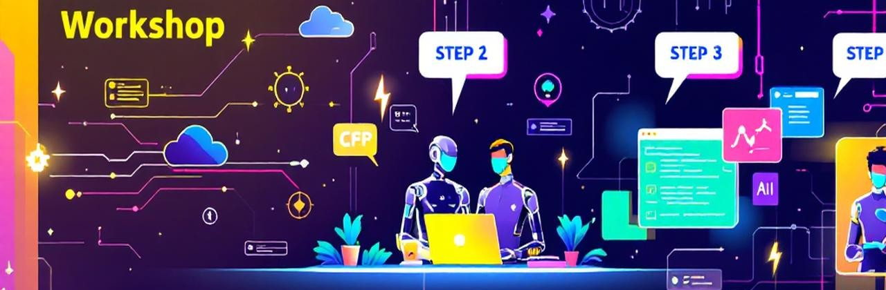

# Parte 4: Avanzado y Recursos



> 🌍 **[← Parte 3: Producción](part3-production.es.md)** | **[🏠 Inicio del Taller](index.es.md)**

---

## 🏠 Navegación

<div class="tip" data-title="Navegación del Taller">

> **📚 Todas las partes:**
> - [🏠 Inicio del Taller](./index.es.md)
> - [Parte 1: Los Fundamentos](./part1-basics.es.md)
> - [Parte 2: Integración de Conocimiento](./part2-knowledge.es.md)
> - [Parte 3: Listo para Producción](./part3-production.es.md)
> - [Parte 4: Avanzado y Recursos](./part4-advanced.es.md) *(actual)*
>
> **🌍 Esta página en otros idiomas:**
> - [🇬🇧 English](/workshop/part4-advanced.md)
> - [🇫🇷 Français](/workshop/translations/fr/part4-advanced.fr.md)
> - [🇮🇳 हिन्दी](/workshop/translations/hi/part4-advanced.hi.md)

</div>

---

## 📦 Código de las Partes 1-3

<details>
<summary>📁 Estructura Completa del Proyecto (clic para expandir)</summary>

```text
helpdesk-agent/
├── src/
│   ├── module1_simple_agent.py      # Agente básico con streaming
│   ├── module2_structured.py        # Salida estructurada Pydantic
│   ├── module3_tools.py             # Herramientas de función
│   ├── module4_ai_search.py         # Integración RAG
│   ├── module5_group_chat.py        # Multi-agente con MCP
│   ├── module6_orchestration.py     # Orquestación Handoff
│   ├── module7_observability.py     # Trazas OpenTelemetry
│   └── module8_evaluation.py        # Evaluación de agentes
├── .env
└── requirements.txt
```

</details>

<details>
<summary>🔧 Componentes Clave (clic para expandir)</summary>

```python
# Patrón de orquestación (módulo 6)
triage_agent = Agent(
    name="Triage",
    instructions="Redirige al agente apropiado",
    handoffs=[billing_agent, technical_agent]
)

# Configuración de observabilidad (módulo 7)
from opentelemetry import trace
from azure.monitor.opentelemetry import configure_azure_monitor

configure_azure_monitor(
    connection_string=os.getenv("APPLICATIONINSIGHTS_CONNECTION_STRING")
)

# Patrón de evaluación (módulo 8)
from agents import evaluate

result = await evaluate(
    agent=support_agent,
    test_cases=test_dataset,
    evaluators=[accuracy_evaluator, relevance_evaluator]
)
```

</details>

<details>
<summary>🔐 Todas las Variables de Entorno (clic para expandir)</summary>

```bash
# .env - Configuración completa del taller
# Parte 1: Azure OpenAI
AZURE_OPENAI_ENDPOINT=https://xxx.openai.azure.com/
AZURE_OPENAI_KEY=xxx
AZURE_OPENAI_DEPLOYMENT=gpt-4o

# Parte 2: Azure AI Search
AZURE_SEARCH_ENDPOINT=https://xxx.search.windows.net
AZURE_SEARCH_KEY=xxx
AZURE_SEARCH_INDEX=helpdesk-index

# Parte 3: Application Insights
APPLICATIONINSIGHTS_CONNECTION_STRING=InstrumentationKey=xxx

# Parte 4: Azure Managed Redis (añadir ahora)
REDIS_CONNECTION_STRING=rediss://xxx.redis.cache.windows.net:6380
```

</details>

<div class="info" data-title="¿No completaste las partes anteriores?">

> Completa [Parte 1](./part1-basics.es.md), [Parte 2](./part2-knowledge.es.md) y [Parte 3](./part3-production.es.md) para tener la solución completa.

</div>

---

Última parte del taller:

| Sección | Contenido |
|---------|-----------|
| **Módulo 9** | Persistencia Redis para memoria |
| **Conclusión** | Resumen de arquitectura |
| **Recursos** | Para ir más allá + enlaces |

---

## Módulo 9 — Integración Redis

Añade persistencia de conversaciones con Azure Managed Redis.

### 📚 Concepto: ¿Por qué Persistencia?

| Sin Persistencia | Con Redis |
|------------------|-----------|
| "¿Cuál fue mi último problema?" → "No lo sé" | "Reportaste un problema de VPN el lunes" |
| Repetir diagnóstico cada vez | Construir sobre soluciones anteriores |
| Estado perdido al reiniciar | Retomar conversaciones en cualquier momento |

**Arquitectura:**

```
SESIÓN 1 (Lunes)
┌────────────────────────────────────┐
│ Usuario: "La VPN se desconecta"    │
│ Agente: "Intenta reiniciar..."     │
│           ↓                        │
│     ┌──────────────┐               │
│     │ REDIS STORE  │               │
│     │ • Historial  │               │
│     │ • Contexto   │               │
│     └──────────────┘               │
└────────────────────────────────────┘
            ↓
SESIÓN 2 (Miércoles)  
┌────────────────────────────────────┐
│ Usuario: "Otra vez el problema VPN"│
│ Agente: "Veo que tenías este       │
│         problema el lunes.         │
│         Probemos otros pasos..."   │
└────────────────────────────────────┘
```

| Componente | Rol |
|------------|-----|
| **RedisProvider** | Memoria semántica (hechos, preferencias) |
| **RedisChatMessageStore** | Historial de conversaciones |
| **thread_id** | Vincula sesiones de la misma conversación |
| **user_id** | Agrupa datos de un usuario |

### 🧠 Pseudocódigo

```
ALGORITMO: Agente con Memoria Redis

1. CONFIGURAR CONEXIÓN REDIS:
   - Connection string desde entorno
   - Definir user_id, thread_id

2. CREAR REDIS PROVIDER:
   - Para memoria semántica
   - Definir index_name y prefix

3. CREAR FACTORY MESSAGE STORE:
   - Retorna RedisChatMessageStore
   - Definir límite max_messages

4. CREAR AGENTE CON PROVIDERS:
   - context_providers=redis_provider
   - chat_message_store_factory=factory

5. SERIALIZAR/DESERIALIZAR:
   - thread.serialize() → Guardar
   - agent.deserialize_thread() → Retomar
```

### 🔨 Ejercicio

Crea `src/module9_redis_agent.py`.

<details>
<summary>💡 Hint: Configuración RedisProvider</summary>

```python
from agent_framework_redis import RedisProvider

redis_provider = RedisProvider(
    redis_url=os.getenv("REDIS_CONNECTION_STRING"),
    index_name="helpdesk_memory",
    prefix="helpdesk",
    application_id="helpdesk_assistant",
    agent_id="support_agent",
    user_id=user_id,
    thread_id=thread_id,
)
```

</details>

<details>
<summary>💡 Hint: Factory Message Store</summary>

```python
from agent_framework_redis import RedisChatMessageStore

def create_message_store():
    return RedisChatMessageStore(
        redis_url=redis_url,
        thread_id=thread_id,
        key_prefix="chat_messages",
        max_messages=100,
    )
```

</details>

<details>
<summary>💡 Hint: Agente con Persistencia</summary>

```python
agent = client.create_agent(
    name="PersistentAssistant",
    instructions="Eres un asistente de TI con memoria...",
    context_providers=redis_provider,
    chat_message_store_factory=create_message_store,
)
```

</details>

<details>
<summary>💡 Hint: Serialización Thread</summary>

```python
# Guardar al final de la sesión
serialized = await thread.serialize()

# Retomar después
resumed_thread = await agent.deserialize_thread(serialized)
result = await agent.run("Continuemos nuestra conversación", thread=resumed_thread)
```

</details>

### ✅ Solución

<details>
<summary>📄 Código Completo Módulo 9</summary>

```python
"""Módulo 9: Integración Redis - Conversaciones persistentes."""
import asyncio
import os
from azure.identity import DefaultAzureCredential
from agent_framework import ChatAgent
from agent_framework.azure_openai import AzureOpenAIChatClient
from agent_framework_redis import RedisProvider, RedisChatMessageStore


async def main() -> None:
    """Crea un agente con memoria Redis."""
    
    redis_url = os.getenv("REDIS_CONNECTION_STRING")
    user_id = "user_12345"
    thread_id = "helpdesk_session_001"
    
    redis_provider = RedisProvider(
        redis_url=redis_url,
        index_name="helpdesk_memory",
        prefix="helpdesk",
        application_id="helpdesk_assistant",
        agent_id="support_agent",
        user_id=user_id,
        thread_id=thread_id,
    )
    
    def create_message_store():
        return RedisChatMessageStore(
            redis_url=redis_url,
            thread_id=thread_id,
            key_prefix="chat_messages",
            max_messages=100,
        )
    
    client = AzureOpenAIChatClient(
        credential=DefaultAzureCredential(),
        endpoint=os.getenv("AZURE_OPENAI_ENDPOINT"),
        deployment_name="gpt-4o",
    )
    
    agent = client.create_agent(
        name="PersistentAssistant",
        instructions="""Eres un asistente de TI con memoria.
        Recuerda preferencias, problemas anteriores y soluciones.""",
        context_providers=redis_provider,
        chat_message_store_factory=create_message_store,
    )
    
    conversaciones = [
        "Hola, tengo problemas con la VPN otra vez",
        "Es el mismo problema de la semana pasada",
        "¿Qué más puedo intentar?",
    ]
    
    thread = agent.get_new_thread()
    print("💬 Iniciando conversación persistente\n")
    
    for mensaje in conversaciones:
        print(f"Usuario: {mensaje}")
        result = await agent.run(mensaje, thread=thread)
        print(f"Agente: {result.text}\n")
    
    # Guardar para después
    serialized = await thread.serialize()
    print(f"📦 Thread guardado: {len(serialized)} bytes")
    
    # Retomar después
    print("\n--- Sesión retomada ---\n")
    resumed_thread = await agent.deserialize_thread(serialized)
    result = await agent.run("¿De qué estábamos hablando?", thread=resumed_thread)
    print(f"Agente: {result.text}")


if __name__ == "__main__":
    asyncio.run(main())
```

</details>

```bash
python src/module9_redis_agent.py
```

<div class="hint" data-title="¿Problemas de Conexión Redis?">

> - Usa `rediss://` (SSL) y no `redis://` para Azure
> - Formato: `rediss://<nombre>.redis.cache.windows.net:6380?password=<clave>`
> - Test: `redis.from_url(url).ping()` → debe retornar `True`

</div>

<div class="task" data-title="🎯 Desafío">

> Añade un TTL para expirar conversaciones antiguas después de 7 días. Crea un helper para listar todos los threads de un usuario.

</div>

---

## Conclusión

🎉 **¡Felicitaciones!** Has construido un **Helpdesk Ops Assistant** completo.

### ✅ Lo que Has Aprendido

| Módulo | Habilidad |
|--------|-----------|
| 1 | Agentes básicos con Agent Framework |
| 2 | Salida estructurada con Pydantic |
| 3 | Herramientas de función y tool calling |
| 4 | Integración de conocimiento con AI Search |
| 5 | Group Chat multi-agente con MCP |
| 6 | Orquestación avanzada con Handoff |
| 7 | Observabilidad con OpenTelemetry |
| 8 | Evaluación y pruebas de agentes |
| 9 | Memoria persistente con Redis |

### 📁 Estructura del Proyecto

```
helpdesk-ops-assistant/
├── 📁 .github/
│   ├── 📁 agents/                      # Agentes Copilot personalizados
│   │   └── AgentArchitect.agent.md
│   ├── 📁 prompts/                     # Prompts reutilizables
│   │   └── evaluate-agent.prompt.md
│   └── copilot-instructions.md         # Instrucciones del proyecto
│
├── 📁 infra/                           # Terraform IaC
│   ├── aai.tf                          # Microsoft Foundry
│   ├── ai_search.tf                    # AI Search
│   ├── foundry.tf                      # AI Foundry workspace
│   ├── foundry_models.tf               # Despliegues de modelos
│   ├── managed_redis.tf                # Redis
│   ├── log.tf                          # App Insights
│   └── variables.tf
│
├── 📁 src/                             # Módulos Python
│   ├── module1_simple_agent.py
│   ├── module2_complexity_analyst.py
│   ├── module3_function_tools.py
│   ├── module4_knowledge_agent.py
│   ├── module5_group_chat.py
│   ├── module6_orchestration.py
│   ├── module7_observability.py
│   ├── module8_evaluation.py
│   └── module9_redis_agent.py
│
├── 📁 docs/                            # Documentación del taller
│   ├── workshop.md
│   └── 📁 assets/
│       └── banner.jpg
│
├── .env.example
├── requirements.txt
└── README.md
```

### 🏗️ Resumen de Arquitectura

```text
┌─────────────────────────────────────────────────────────────────────┐
│                           📥 ENTRADA                               │
│                         👤 Usuario                                  │
└──────────────────────────────┬──────────────────────────────────────┘
                               │
                               ▼
┌─────────────────────────────────────────────────────────────────────┐
│                      🎯 ORQUESTACIÓN                                │
│                       🧠 Orquestador                               │
└───────────┬──────────────────┼──────────────────┬───────────────────┘
            │                  │                  │
            ▼                  ▼                  ▼
       ┌─────────┐       ┌───────────┐     ┌───────────────┐
       │⚡ Simple │       │👥 Group   │     │🚨 Escalamiento │
       │         │       │   Chat    │     │               │
       └────┬────┘       └─────┬─────┘     └───────────────┘
            │                  │                   
            │           ┌──────┴──────┐            
            │           │  🤖 AGENTES │            
            │           │ ┌──────────┐│            
            │           │ │📚 Learn  ││            
            │           │ │   Agent  ││            
            │           │ ├──────────┤│            
            │           │ │🐙 GitHub ││            
            │           │ │   Agent  ││            
            │           │ └────┬─────┘│            
            │           └──────┼──────┘            
            │                  │                   
            │                  ▼                   
            │         ┌───────────────┐            
            │         │🔍 AI Search   │            
            │         └───────────────┘            
            │                                      
            └───────────────┬──────────────────────
                            ▼
┌─────────────────────────────────────────────────────────────────────┐
│                      ☁️ SERVICIOS AZURE                            │
│       💾 Redis Cache         📊 Application Insights                │
└─────────────────────────────────────────────────────────────────────┘
```

---

## Recursos

### 📚 Documentación Principal

| Recurso | Enlace |
|---------|--------|
| **Agent Framework GitHub** | [🔗 microsoft/agent-framework](https://github.com/microsoft/agent-framework){target="_blank"} |
| **Agent Framework Docs** | [🔗 learn.microsoft.com](https://learn.microsoft.com/es-es/agent-framework/){target="_blank"} |
| **AI Agents for Beginners** | [🔗 Módulo 14: Agent Framework](https://microsoft.github.io/ai-agents-for-beginners/14-microsoft-agent-framework/){target="_blank"} |
| **Ejemplos Workflows** | [🔗 Workflows README](https://github.com/microsoft/agent-framework/blob/main/python/samples/getting_started/workflows/README.md){target="_blank"} |

### 🚀 Funcionalidades Avanzadas

| Funcionalidad | Descripción | Enlace |
|---------------|-------------|--------|
| **Shared State** | Compartir estado entre agentes | [🔗 Guía](https://learn.microsoft.com/es-es/agent-framework/user-guide/workflows/shared-states){target="_blank"} |
| **Checkpoints** | Guardar/restaurar estado del workflow | [🔗 Guía](https://learn.microsoft.com/es-es/agent-framework/user-guide/workflows/checkpoints){target="_blank"} |
| **AG-UI** | Construir UIs de agentes con streaming | [🔗 Integración AG-UI](https://learn.microsoft.com/es-es/agent-framework/integrations/ag-ui/){target="_blank"} |

### 🔐 Producción y Seguridad

| Tema | Descripción | Enlace |
|------|-------------|--------|
| **Azure APIM** | Asegurar y escalar APIs de agentes | [🔗 Docs APIM](https://learn.microsoft.com/es-es/azure/api-management/){target="_blank"} |
| **GenAI Gateway** | Rate limiting basado en tokens | [🔗 Integración OpenAI](https://learn.microsoft.com/es-es/azure/api-management/api-management-howto-integrate-openai){target="_blank"} |
| **Identidades Administradas** | Eliminar secretos | [🔗 Docs MI](https://learn.microsoft.com/es-es/azure/active-directory/managed-identities-azure-resources/){target="_blank"} |

### 🔌 MCP (Model Context Protocol)

| Tema | Descripción | Enlace |
|------|-------------|--------|
| **Especificación MCP** | Protocolo abierto para conexiones IA-datos | [🔗 modelcontextprotocol.io](https://modelcontextprotocol.io/){target="_blank"} |
| **Servidores MCP** | Servidores preconstruidos (GitHub, Slack, etc.) | [🔗 Registro de Servidores](https://github.com/modelcontextprotocol/servers){target="_blank"} |
| **Azure MCP** | Servidor MCP oficial de Azure | [🔗 Azure MCP](https://github.com/Azure/azure-mcp){target="_blank"} |

### 🏛️ Gobernanza IA

| Tema | Descripción | Enlace |
|------|-------------|--------|
| **Content Safety** | Filtrar contenido dañino | [🔗 Content Safety](https://learn.microsoft.com/es-es/azure/ai-services/content-safety/){target="_blank"} |
| **Prompt Shields** | Bloquear inyección de prompt | [🔗 Prompt Shields](https://learn.microsoft.com/es-es/azure/ai-services/content-safety/concepts/prompt-shields){target="_blank"} |
| **Dashboard RAI** | Monitorear equidad y fiabilidad | [🔗 Dashboard RAI](https://learn.microsoft.com/es-es/azure/machine-learning/concept-responsible-ai-dashboard){target="_blank"} |

### ☁️ Patrones de Arquitectura

| Tema | Descripción | Enlace |
|------|-------------|--------|
| **IA en Azure** | Arquitecturas de referencia | [🔗 Arquitectura IA](https://learn.microsoft.com/es-es/azure/architecture/ai-ml/){target="_blank"} |
| **Patrón RAG** | Buenas prácticas RAG | [🔗 Guía RAG](https://learn.microsoft.com/es-es/azure/architecture/ai-ml/guide/rag/rag-solution-design-and-evaluation-guide){target="_blank"} |
| **Chat E2E** | Baseline chat empresarial | [🔗 Baseline Chat](https://learn.microsoft.com/es-es/azure/architecture/ai-ml/architecture/baseline-openai-e2e-chat){target="_blank"} |

---

### 📜 Instrucciones Personalizadas Copilot

Crea `.github/copilot-instructions.md`:

```markdown
# Helpdesk Ops Assistant - Instrucciones Copilot

## Contexto del Proyecto
Proyecto Microsoft Agent Framework para helpdesk TI con orquestación multi-agente.

## Stack Técnico
- Framework: Microsoft Agent Framework (paquete agent-framework)
- LLM: Azure OpenAI GPT-4o via AzureOpenAIChatClient
- Auth: DefaultAzureCredential (nunca claves hardcodeadas)
- Async: Todas las operaciones usan async/await

## Patrones de Código
- Usar @ai_function para herramientas
- Usar Pydantic con response_format= para salida estructurada
- Envolver operaciones en spans OpenTelemetry

## Patrones de Workflow
- Simple: agent.run() directo
- Group Chat: GroupChatBuilder para colaboración
- Handoff: HandoffBuilder para enrutamiento
```

---

### 🐛 ¿Encontraste un Problema?

<div class="task" data-title="Ayúdanos a Mejorar">

> - 🐛 **Bug**: [Abrir Issue](https://github.com/yourorg/hands-on-lab-agent-framework-on-azure/issues/new?title=[BUG]%20)
> - 💡 **Funcionalidad**: [Solicitar Feature](https://github.com/yourorg/hands-on-lab-agent-framework-on-azure/issues/new?title=[FEATURE]%20)
> - 💬 **Preguntas**: [Discusiones](https://github.com/yourorg/hands-on-lab-agent-framework-on-azure/discussions)

</div>

---

### 🚀 Próximos Pasos

1. Añadir más agentes especializados para tu caso de uso
2. Implementar manejo de errores para producción
3. Configurar CI/CD para despliegue de agentes
4. Configurar autoescalado para hosting en Azure Functions

---

> 🌍 **[← Parte 3: Producción](./part3-production.es.md)** | **[🏠 Inicio del Taller](./index.es.md)**

<div class="info" data-title="🎉 ¡Taller Completado!">

> **¡Gracias por seguir este taller!**
> 
> Has aprendido a construir agentes IA listos para producción con Microsoft Agent Framework en Azure.
> 
> ¡Comparte tu experiencia en redes sociales! 🚀

</div>
