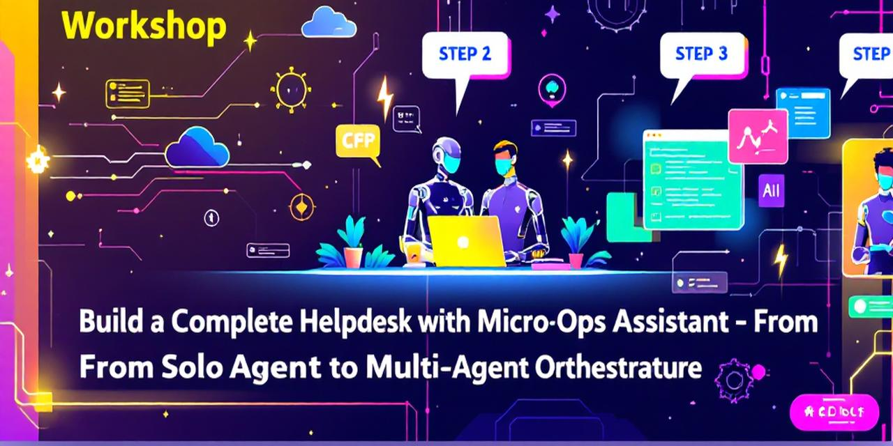

# Partie 1 : Les fondamentaux



> 🌍 **[🏠 Accueil](./index.fr.md)** | **[Partie 2 : Gestion des connaissances →](./part2-knowledge.fr.md)**

Bienvenue ! Dans cette partie, vous allez :

| Étape | Ce que vous apprendrez |
|-------|------------------------|
| **Mise en place** | Installer les outils et déployer l'infrastructure Azure |
| **Module 1** | Créer un agent simple avec streaming |
| **Module 2** | Obtenir des réponses structurées avec Pydantic |
| **Module 3** | Ajouter des outils personnalisés |

---

## Prérequis

### 🛠️ Outils nécessaires

| Outil | Version | Installation |
|-------|---------|--------------|
| Python | 3.11+ | [python.org](https://python.org) |
| Azure CLI | Dernière version | `winget install Microsoft.AzureCLI` |
| Terraform | 1.5+ | `winget install Hashicorp.Terraform` |
| VS Code | Dernière | [code.visualstudio.com](https://code.visualstudio.com) |
| Git | Dernière | `winget install Git.Git` |

### ☁️ Compte Azure

- Abonnement Azure actif avec crédits
- Permissions pour créer des groupes de ressources
- Accès à Azure OpenAI (demander via Azure Portal si nécessaire)

### 📦 Extensions VS Code

| Extension | Objectif |
|-----------|----------|
| Python | Support langage Python |
| GitHub Copilot | Assistant IA pour le code |
| Azure Tools | Intégration Azure |
| Terraform | Support IaC |

<div class="tip" data-title="Astuce Installation">

> **Installation rapide Windows :**
> ```powershell
> winget install Python.Python.3.11
> winget install Microsoft.AzureCLI
> winget install Hashicorp.Terraform
> ```

</div>

---

## Déploiement Infrastructure

### Étape 1 : Cloner le Repo

```bash
git clone https://github.com/yourorg/hands-on-lab-agent-framework-on-azure.git
cd hands-on-lab-agent-framework-on-azure
```

### Étape 2 : Connexion Azure

```bash
az login
az account set --subscription "<VOTRE_SUBSCRIPTION_ID>"
```

### Étape 3 : Déployer avec Terraform

```bash
cd infra
terraform init
terraform plan -out=tfplan
terraform apply tfplan
```

<div class="warning" data-title="⏱️ Temps de Déploiement">

> Le déploiement prend **15-20 minutes**. Les ressources créées :
> - Microsoft Foundry + Hub
> - Azure OpenAI avec GPT-4o
> - Azure AI Search
> - Azure Managed Redis
> - Application Insights

</div>

### Étape 4 : Configurer l'Environnement

```bash
# Récupérer les outputs Terraform
terraform output -json > ../outputs.json

# Créer le fichier .env
cd ..
cp .env.example .env
# Éditer .env avec les valeurs de outputs.json
```

### Étape 5 : Installer les Dépendances Python

```bash
python -m venv .venv
.venv\Scripts\activate  # Windows
pip install -r requirements.txt
```

<div class="task" data-title="✅ Vérification">

> Testez votre configuration :
> ```bash
> python -c "from azure.identity import DefaultAzureCredential; print('OK!')"
> ```

</div>

---

## Module 1 — Agent Simple

Créez votre premier agent conversationnel avec streaming.

### 📚 Concept

L'Agent Framework suit un pattern simple :

```
Client → Agent → Thread → Réponse
```

| Composant | Rôle |
|-----------|------|
| **Client** | Connexion à Azure OpenAI |
| **Agent** | Configuration (nom, instructions, outils) |
| **Thread** | Historique de conversation |
| **run()** | Exécution avec réponse |

### 🧠 Pseudo-code

```
ALGORITHME : Agent Simple avec Streaming

1. CRÉER CLIENT Azure OpenAI
   - Authentification : DefaultAzureCredential
   - Endpoint : variable d'environnement
   - Modèle : gpt-4o

2. CRÉER AGENT
   - Nom : "HelpdeskAgent"
   - Instructions : "Tu es un assistant IT..."

3. OBTENIR THREAD (nouveau ou existant)

4. EXÉCUTER REQUÊTE
   - Envoyer message utilisateur
   - Streamer la réponse token par token
```

### 🔨 Exercice

Créez `src/module1_simple_agent.py`.

<details>
<summary>💡 Indice : Création Client</summary>

```python
from azure.identity import DefaultAzureCredential
from agent_framework.azure_openai import AzureOpenAIChatClient

client = AzureOpenAIChatClient(
    credential=DefaultAzureCredential(),
    endpoint=os.getenv("AZURE_OPENAI_ENDPOINT"),
    deployment_name="gpt-4o",
)
```

</details>

<details>
<summary>💡 Indice : Création Agent</summary>

```python
agent = client.create_agent(
    name="HelpdeskAgent",
    instructions="""Tu es un assistant IT helpdesk.
    Aide les utilisateurs avec leurs problèmes techniques.
    Sois concis et utile.""",
)
```

</details>

<details>
<summary>💡 Indice : Streaming</summary>

```python
thread = agent.get_new_thread()
async for chunk in agent.run_stream("Comment réinitialiser mon mot de passe ?", thread=thread):
    if hasattr(chunk, 'text'):
        print(chunk.text, end="", flush=True)
```

</details>

### ✅ Solution

<details>
<summary>📄 Code Complet Module 1</summary>

```python
"""Module 1 : Agent Simple avec Streaming."""
import asyncio
import os
from azure.identity import DefaultAzureCredential
from agent_framework.azure_openai import AzureOpenAIChatClient


async def main():
    client = AzureOpenAIChatClient(
        credential=DefaultAzureCredential(),
        endpoint=os.getenv("AZURE_OPENAI_ENDPOINT"),
        deployment_name="gpt-4o",
    )
    
    agent = client.create_agent(
        name="HelpdeskAgent",
        instructions="""Tu es un assistant IT helpdesk.
        Aide les utilisateurs avec leurs problèmes techniques.
        Sois concis et utile.""",
    )
    
    thread = agent.get_new_thread()
    
    print("Agent: ", end="")
    async for chunk in agent.run_stream(
        "Comment réinitialiser mon mot de passe ?",
        thread=thread
    ):
        if hasattr(chunk, 'text'):
            print(chunk.text, end="", flush=True)
    print()


if __name__ == "__main__":
    asyncio.run(main())
```

</details>

```bash
python src/module1_simple_agent.py
```

---

## Module 2 — Sortie Structurée

Utilisez Pydantic pour garantir des réponses JSON structurées.

### 📚 Concept

| Sans Structure | Avec Pydantic |
|----------------|---------------|
| Texte libre imprévisible | JSON garanti |
| Parsing manuel fragile | Validation automatique |
| Erreurs silencieuses | Erreurs explicites |

### 🧠 Pseudo-code

```
ALGORITHME : Sortie Structurée

1. DÉFINIR MODÈLE PYDANTIC
   - catégorie : str (enum)
   - sévérité : str (enum)
   - résumé : str

2. CRÉER AGENT avec response_format=MonModèle

3. EXÉCUTER : La réponse est automatiquement parsée

4. ACCÉDER : result.category, result.severity, etc.
```

### 🔨 Exercice

Créez `src/module2_complexity_analyst.py`.

<details>
<summary>💡 Indice : Modèle Pydantic</summary>

```python
from pydantic import BaseModel, Field

class TicketAnalysis(BaseModel):
    category: str = Field(description="network|hardware|software|access|other")
    severity: str = Field(description="low|medium|high|critical")
    summary: str = Field(description="Résumé bref du problème")
```

</details>

<details>
<summary>💡 Indice : Agent Structuré</summary>

```python
agent = client.create_agent(
    name="TicketAnalyst",
    instructions="Analyse les tickets IT et classifie-les.",
    response_format=TicketAnalysis,
)
```

</details>

### ✅ Solution

<details>
<summary>📄 Code Complet Module 2</summary>

```python
"""Module 2 : Sortie Structurée avec Pydantic."""
import asyncio
import os
from pydantic import BaseModel, Field
from azure.identity import DefaultAzureCredential
from agent_framework.azure_openai import AzureOpenAIChatClient


class TicketAnalysis(BaseModel):
    category: str = Field(description="network|hardware|software|access|other")
    severity: str = Field(description="low|medium|high|critical")
    summary: str = Field(description="Résumé bref du problème")


async def main():
    client = AzureOpenAIChatClient(
        credential=DefaultAzureCredential(),
        endpoint=os.getenv("AZURE_OPENAI_ENDPOINT"),
        deployment_name="gpt-4o",
    )
    
    agent = client.create_agent(
        name="TicketAnalyst",
        instructions="""Analyse les tickets IT.
        Détermine la catégorie et la sévérité.""",
        response_format=TicketAnalysis,
    )
    
    tickets = [
        "Je ne peux pas accéder à ma boîte mail depuis ce matin",
        "URGENT: Le serveur de production est down!",
        "Comment configurer le VPN sur Mac?",
    ]
    
    for ticket in tickets:
        print(f"\nTicket: {ticket}")
        result = await agent.run(ticket)
        analysis = result.structured_output
        print(f"  Catégorie: {analysis.category}")
        print(f"  Sévérité: {analysis.severity}")
        print(f"  Résumé: {analysis.summary}")


if __name__ == "__main__":
    asyncio.run(main())
```

</details>

```bash
python src/module2_complexity_analyst.py
```

---

## Module 3 — Outils Fonction

Donnez à votre agent la capacité d'exécuter des actions.

### 📚 Concept

```text
┌─────────────┐     ┌─────────────┐     ┌─────────────┐
│ Utilisateur │     │   Agent     │     │   Outil     │
└──────┬──────┘     └──────┬──────┘     └──────┬──────┘
       │                   │                   │
       │ "Quel est le      │                   │
       │  statut du        │                   │
       │  serveur email?"  │                   │
       │──────────────────▶│                   │
       │                   │                   │
       │                   │ check_system_     │
       │                   │ status("email")  │
       │                   │──────────────────▶│
       │                   │                   │
       │                   │ {"status":        │
       │                   │  "operational"}   │
       │                   │◀─ ─ ─ ─ ─ ─ ─ ─ ─│
       │                   │                   │
       │ "Le serveur email │                   │
       │  fonctionne       │                   │
       │  normalement."    │                   │
       │◀─ ─ ─ ─ ─ ─ ─ ─ ─│                   │
       │                   │                   │
```

| Sans Outils | Avec Outils |
|-------------|-------------|
| Répond depuis le training | Exécute des actions réelles |
| Données potentiellement obsolètes | Données temps réel |

### 🧠 Pseudo-code

```
ALGORITHME : Agent avec Outils

1. DÉFINIR FONCTION avec @ai_function
   - Docstring = description pour le LLM
   - Typage = schéma des paramètres

2. CRÉER AGENT avec tools=[ma_fonction]

3. EXÉCUTION AUTOMATIQUE :
   - LLM décide quand appeler l'outil
   - Framework exécute la fonction
   - Résultat intégré dans la réponse
```

### 🔨 Exercice

Créez `src/module3_function_tools.py`.

<details>
<summary>💡 Indice : Décorateur @ai_function</summary>

```python
from agent_framework import ai_function

@ai_function
def check_system_status(system_name: str) -> dict:
    """Vérifie le statut d'un système.
    
    Args:
        system_name: Nom du système à vérifier (email, vpn, crm, etc.)
    
    Returns:
        Dictionnaire avec le statut du système
    """
    # Simulation - en production, vraie vérification
    return {
        "system": system_name,
        "status": "operational",
        "last_check": "2024-01-15T10:30:00Z"
    }
```

</details>

<details>
<summary>💡 Indice : Agent avec Outils</summary>

```python
agent = client.create_agent(
    name="SystemMonitor",
    instructions="Tu peux vérifier le statut des systèmes.",
    tools=[check_system_status, create_ticket],
)
```

</details>

### ✅ Solution

<details>
<summary>📄 Code Complet Module 3</summary>

```python
"""Module 3 : Outils Fonction."""
import asyncio
import os
from azure.identity import DefaultAzureCredential
from agent_framework import ai_function
from agent_framework.azure_openai import AzureOpenAIChatClient


@ai_function
def check_system_status(system_name: str) -> dict:
    """Vérifie le statut d'un système IT.
    
    Args:
        system_name: Nom du système (email, vpn, crm)
    """
    statuses = {
        "email": "operational",
        "vpn": "degraded",
        "crm": "operational",
    }
    return {
        "system": system_name,
        "status": statuses.get(system_name, "unknown"),
    }


@ai_function
def create_ticket(title: str, priority: str, description: str) -> dict:
    """Crée un ticket de support.
    
    Args:
        title: Titre du ticket
        priority: low|medium|high|critical
        description: Description détaillée
    """
    ticket_id = f"TKT-{hash(title) % 10000:04d}"
    return {"ticket_id": ticket_id, "status": "created"}


async def main():
    client = AzureOpenAIChatClient(
        credential=DefaultAzureCredential(),
        endpoint=os.getenv("AZURE_OPENAI_ENDPOINT"),
        deployment_name="gpt-4o",
    )
    
    agent = client.create_agent(
        name="HelpdeskAgent",
        instructions="""Tu es un assistant helpdesk.
        Utilise tes outils pour vérifier les systèmes et créer des tickets.""",
        tools=[check_system_status, create_ticket],
    )
    
    thread = agent.get_new_thread()
    
    queries = [
        "Quel est le statut du VPN ?",
        "Crée un ticket pour le problème VPN, priorité haute",
    ]
    
    for query in queries:
        print(f"\nUser: {query}")
        result = await agent.run(query, thread=thread)
        print(f"Agent: {result.text}")


if __name__ == "__main__":
    asyncio.run(main())
```

</details>

```bash
python src/module3_function_tools.py
```

---

## Résumé Partie 1

Vous avez appris :

| Module | Compétence |
|--------|------------|
| **Setup** | ✅ Déploiement infra Azure avec Terraform |
| **1** | ✅ Agent simple avec streaming |
| **2** | ✅ Sortie structurée avec Pydantic |
| **3** | ✅ Outils fonction avec @ai_function |

**Pattern de base établi :**

```python
# 1. Client
client = AzureOpenAIChatClient(...)

# 2. Agent
agent = client.create_agent(
    name="...",
    instructions="...",
    tools=[...],           # Optionnel
    response_format=Model,  # Optionnel
)

# 3. Exécution
result = await agent.run(query, thread=thread)
```

> 🌍 **[🏠 Accueil](index.fr.md)** | **[Partie 2 : Intégration Connaissances →](part2-knowledge.fr.md)**
